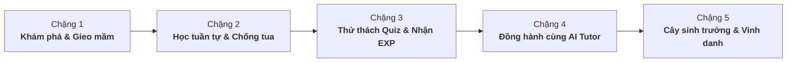

# 🌿 SkillGarden — Nền Tảng Học Kỹ Năng IT Kết Hợp Gamification & Cây Kỹ Năng 3D

[](https://www.php.net/)
[](https://react.dev/)
[](https://www.typescriptlang.org/)
[](https://vitejs.dev/)
[](https://tailwindcss.com/)
[](https://threejs.org/)
[](https://www.mysql.com/)
[](https://www.docker.com/)
[](LICENSE)

> **SkillGarden** là nền tảng quản lý học tập (LMS) thế hệ mới dành cho sinh viên và người học IT.  
> Ứng dụng biến quá trình tích lũy kiến thức thành trải nghiệm nuôi dưỡng **Khu vườn Kỹ năng 3D trực quan**, kết hợp cơ chế **mở khóa bài học tuần tự (anti-skip)** và **Trợ lý AI Tutor thông minh** đồng hành 24/7.

---

## 📌 Mục Lục
- [Tổng quan](#-tổng-quan)
- [Vòng đời học tập (5 Chặng)](#-vòng-đời-học-tập-5-chặng)
- [Các phân hệ & Tính năng cốt lõi](#-các-phân-hệ--tính-năng-cốt-lõi)
- [Kiến trúc hệ thống](#-kiến-trúc-hệ-thống)
- [Tech Stack](#-tech-stack)
- [Cấu trúc thư mục](#-cấu-trúc-thư-mục)
- [Cài đặt & Chạy Local](#-cài-đặt--chạy-local)
  - [Yêu cầu hệ thống](#yêu-cầu-hệ-thống)
  - [Cách 1: Khởi chạy toàn diện qua Docker (Khuyến nghị)](#cách-1-khởi-chạy-toàn-diện-qua-docker-khuyến-nghị)
  - [Cách 2: Chạy môi trường Development thủ công](#cách-2-chạy-môi-trường-development-thủ-công)
  - [Khởi tạo & Nạp dữ liệu mẫu (Database Seed)](#khởi-tạo--nạp-dữ-liệu-mẫu-database-seed)
- [Giấy phép](#-giấy-phép)

---

## 📖 Tổng quan

Học lập trình và kỹ năng IT trực tuyến thường đối mặt với tình trạng thiếu động lực, tỷ lệ bỏ cuộc giữa chừng cao và thiếu phản hồi tức thì khi gặp khúc mắc. **SkillGarden** giải quyết các vấn đề này thông qua 3 trụ cột chính:

1. **Gamification & 3D Tree Evolution**: Mỗi kỹ năng IT (Frontend, Backend, AI, DevOps...) là một hạt mầm. Khi học viên hoàn thành bài giảng và làm quiz, cây sẽ hấp thu EXP để lớn dần qua các giai đoạn (Hạt mầm ➔ Cây non ➔ Cây trưởng thành ➔ Cây nở hoa kết trái).
2. **Kỷ luật học tập & Kiểm soát tiến độ**: Chống tua nhanh/bỏ bài (anti-skip video), chỉ mở khóa bài học kế tiếp khi đã tiếp thu trọn vẹn kiến thức và hoàn thành đánh giá.
3. **Trợ lý học tập cá nhân hóa (AI Tutor)**: Tích hợp trí tuệ nhân tạo nắm bắt chính xác ngữ cảnh bài học hiện tại, sẵn sàng phân tích code, giải thích khái niệm và chữa bài ngay tại giao diện xem video.

---

## 🔄 Vòng đời học tập (5 Chặng)

Quá trình phát triển kỹ năng của học viên được mô hình hóa theo chu trình 5 chặng liên hoàn:



| Chặng | Tên giai đoạn | Nội dung & Cơ chế thực hiện |
| :---: | :--- | :--- |
| **1** | **Khám phá & Gieo mầm** | Khảo sát danh mục kỹ năng (Skill Catalog), chọn lộ trình phù hợp và gieo cây giống vào **Khu vườn của tôi (My Garden)**. |
| **2** | **Học tuần tự & Chống tua** | Theo dõi bài giảng video theo thứ tự định sẵn; hệ thống khóa bài tiếp theo và giám sát tiến độ thực học, ngăn chặn hành vi tua video. |
| **3** | **Thử thách Quiz & Nhận EXP** | Vượt qua bài kiểm tra trắc nghiệm cuối bài để đánh giá mức độ hiểu bài, tích lũy điểm kinh nghiệm (EXP) và giọt nước tưới cây. |
| **4** | **Đồng hành cùng AI Tutor** | Tương tác trực tiếp với AI trợ giảng trong phòng học để giải thích thuật toán, debug lỗi code hoặc tóm tắt nội dung bài học. |
| **5** | **Cây sinh trưởng & Vinh danh** | Cây 3D chuyển hóa hình thái sinh trưởng, cập nhật thứ hạng trên **Bảng xếp hạng (Leaderboard)** và duy trì chuỗi học tập (Streak). |

---

## 🎮 Các phân hệ & Tính năng cốt lõi

### 1. Khu vườn Kỹ năng 3D (Interactive 3D Skill Garden)
- Dựng và hiển thị mô hình 3D bằng **Three.js** kết hợp công nghệ nén **Draco Loader**, tối ưu thời gian tải mô hình xuống dưới 1 giây.
- Cây kỹ năng thay đổi hình thái theo thời gian thực tương ứng với Level và EXP tích lũy.
- Cho phép xoay 360°, phóng to/thu nhỏ, tương tác trực tiếp với từng nhánh cây để xem thông tin kỹ năng.

### 2. Phòng học Video & Mở khóa tuần tự (Sequential Video Learning)
- Hệ thống video player chuyên dụng với cơ chế **chặn tua video (seek restriction)** đối với bài học chưa hoàn thành.
- Tự động lưu tiến độ xem từng giây (`progress.php`) và ghi nhận hoàn thành (`complete.php`).
- Mở khóa tự động bài học kế tiếp trong lộ trình học tập khi đáp ứng đầy đủ điều kiện.

### 3. Phòng kiểm tra & Đánh giá (Quiz Room)
- Ngân hàng câu hỏi trắc nghiệm đa dạng gắn liền với từng bài học kỹ năng.
- Chấm điểm tự động, giới hạn thời gian làm bài và hiển thị kết quả phân tích tức thì.
- Thưởng EXP và điểm tưới cây tương ứng với kết quả bài thi.

### 4. Trợ lý AI Tutor thông minh (Context-Aware AI Assistant)
- Tích hợp mô hình AI ngôn ngữ lớn, tự động nạp ngữ cảnh bài học (tiêu đề, tóm tắt, nội dung giảng dạy) vào prompt.
- Giao diện chat dạng trượt mượt mà ngay cạnh video bài học, hỗ trợ phản hồi nhanh và lưu trữ lịch sử hội thoại riêng biệt theo từng user.

### 5. Cổng Quản trị & Phân quyền đa cấp (Admin & Superadmin Portal)
- **Phê duyệt học viên**: Cơ chế kiểm duyệt tài khoản đăng ký mới trước khi cho phép truy cập hệ thống.
- **Phân quyền chi tiết (Granular RBAC)**: Quản lý quyền theo từng chức năng (quản lý bài học, duyệt thành viên, xem thống kê, gán quyền admin).
- **Quản lý nội dung LMS**: Đăng tải bài học, upload video bài giảng và quản lý ngân hàng câu hỏi quiz.

### 6. Cổng nạp & Mở khóa gói học tập (Payment Architecture Spec)
- Đặc tả kiến trúc tích hợp cổng thanh toán trực tuyến (PayOS / MoMo / VNPay).
- Giao diện nạp tiền và xác nhận giao dịch bằng mã QR động tiện lợi.

---

## 🏗️ Kiến trúc hệ thống

Dự án áp dụng mô hình phân tách độc lập giữa **Frontend SPA** và **Backend RESTful API**:

- **Frontend**: Single Page Application (SPA) xây dựng trên **React 19**, định kiểu với **Tailwind CSS v4**, quản lý state tập trung với **Zustand** và render 3D hiệu năng cao qua **Three.js + Draco**.
- **Backend**: RESTful API hướng đối tượng viết bằng **PHP 8.3**, kiến trúc phân tầng rõ ràng:
  - `api/`: Tiếp nhận HTTP Request và ánh xạ endpoint.
  - `src/Middleware/`: Kiểm thực JWT Bearer Token, kiểm tra phân quyền RBAC và phê duyệt tài khoản.
  - `src/Services/`: Xử lý business logic trọng yếu (mở khóa bài học, tính EXP, điều khiển AI, xử lý dữ liệu vườn).
  - `src/Models/`: Tương tác cơ sở dữ liệu MySQL qua PDO chuẩn an toàn, chống SQL Injection.
- **Cơ sở dữ liệu**: **MySQL 8.4** chuẩn hóa quan hệ giữa Người dùng, Quyền hạn, Cây kỹ năng, Bài học, Tiến độ và Lịch sử hỏi đáp AI.

---

## 💻 Tech Stack

| Tầng (Layer) | Công nghệ / Thư viện chính |
| :--- | :--- |
| **Frontend Framework** | React 19, Vite 6, TypeScript 5.7 |
| **Styling & Animation** | Tailwind CSS v4, Lucide React, GSAP, clsx |
| **3D Engine** | Three.js, Draco3D Decoder, @gltf-transform |
| **State Management** | Zustand |
| **Routing** | React Router v7 |
| **Backend API** | PHP 8.3 (Clean OOP, Services, Middleware Architecture) |
| **Cơ sở dữ liệu** | MySQL 8.4 (InnoDB, PDO) |
| **Bảo mật & Auth** | JWT (JSON Web Tokens) Bearer Authentication, Password Hashing |
| **Tích hợp AI** | AI Tutor Engine (Context-driven streaming / REST prompt) |
| **DevOps & Container** | Docker, Docker Compose, Nginx Reverse Proxy |
| **Kiểm thử (Testing)** | Vitest, Testing Library (Frontend), PHPUnit (Backend) |

---

## 📁 Cấu trúc thư mục

```text
PLT-Skill_garden/
├── skill_garden-Backend/            # Backend RESTful API (PHP 8.3)
│   ├── api/                         # REST API Endpoints
│   │   ├── admin/                   # API quản trị và xét duyệt học viên
│   │   ├── ai-tutor/                # API chat và truy vấn lịch sử AI Tutor
│   │   ├── user/                    # API dữ liệu cá nhân, khu vườn, bài học
│   │   └── lessons.php              # API danh mục và chi tiết bài học
│   ├── bin/                         # CLI utility scripts (seed_users, grant_permissions)
│   ├── config/                      # Cấu hình Database, CORS, JWT và Bootstrap
│   ├── database/                    # schema.sql, ai_schema.sql, users.json mẫu
│   ├── public/                      # Static assets và thư mục upload video/avatar
│   ├── src/
│   │   ├── Middleware/              # AuthMiddleware, AdminMiddleware
│   │   ├── Models/                  # User, Lesson, Garden entities
│   │   └── Services/                # AuthService, LessonService, GardenService, AIService
│   ├── tests/                       # Unit test (PHPUnit)
│   ├── Dockerfile                   # Dockerfile cấu hình PHP 8.3 + Apache
│   └── .env                         # Biến môi trường Backend
├── skill_garden-Frontend/           # Frontend SPA (React 19 + TypeScript)
│   ├── public/                      # Mô hình 3D (.glb), Draco decoder, favicon, PWA manifest
│   ├── src/
│   │   ├── components/              # UI components, 3D Tree Viewer, AI Chat Widget
│   │   ├── layouts/                 # DashboardLayout, AuthLayout
│   │   ├── pages/                   # Trang nghiệp vụ: MyGarden, VideoLearning, Admin, Quiz...
│   │   ├── services/                # API Client services & learning progress tracker
│   │   ├── stores/                  # Zustand stores (aiChatStore, auth, garden)
│   │   └── styles/                  # Tailwind CSS v4 & custom animations
│   ├── Dockerfile                   # Multi-stage Dockerfile (Vite build + Nginx alpine)
│   ├── nginx.conf                   # Cấu hình Nginx routing SPA và proxy
│   └── package.json                 # Dependencies & Scripts
├── docs/                            # Tài liệu đặc tả SRS, tài liệu hướng dẫn Dev Team
├── docker-compose.yml               # Orchestration toàn bộ hệ thống (DB, Backend, Frontend)
└── README.md
```

---

## 🚀 Cài đặt & Chạy Local

### Yêu cầu hệ thống
- [Docker](https://www.docker.com/) & Docker Compose
- *Hoặc nếu chạy không qua Docker:*
  - [Node.js 18+](https://nodejs.org/) & npm
  - [PHP 8.3+](https://www.php.net/) & Composer
  - [MySQL 8.0+](https://dev.mysql.com/downloads/installer/)

---

### Cách 1: Khởi chạy toàn diện qua Docker (Khuyến nghị)

Toàn bộ hệ thống gồm MySQL Database, PHP Backend API và Nginx React Frontend được khởi chạy đồng bộ chỉ bằng một lệnh duy nhất:

```bash
# 1. Build image và khởi động toàn bộ services
docker compose up --build -d

# 2. Xem logs hoạt động
docker compose logs -f

# 3. Dừng hệ thống
docker compose down
```

* 🌐 **Frontend App**: `http://localhost:5173`
* 🔌 **Backend REST API**: `http://localhost:8000`
* 🗄️ **MySQL Database**: `localhost:3307` 

---

### Cách 2: Chạy môi trường Development thủ công

#### 1. Khởi động Backend (PHP)
```bash
cd skill_garden-Backend

# Cài đặt PHP dependencies (nếu có)
composer install

# Khởi chạy server development
php -S 127.0.0.1:8000
```

#### 2. Khởi động Frontend (React + Vite)
Mở một terminal mới:
```bash
cd skill_garden-Frontend

# Cài đặt dependencies
npm install

# Khởi chạy dev server với HMR
npm run dev
```
Truy cập giao diện học tập tại: `http://localhost:5173`.

---

### Khởi tạo & Nạp dữ liệu mẫu (Database Seed)

Khi sử dụng Docker, database `schema.sql` sẽ được tự động import. Để khởi tạo đầy đủ dữ liệu người dùng mẫu và cấu trúc phân quyền, bạn chạy lệnh:

```bash
# Nạp dữ liệu tài khoản và phân quyền
cd skill_garden-Backend
php bin/seed_users.php
php bin/grant_all_admin_perms.php
```


## 📄 Giấy phép

Dự án phát hành theo giấy phép **MIT License** — được phát triển phục vụ mục đích học tập và nghiên cứu kỹ thuật công nghệ.
