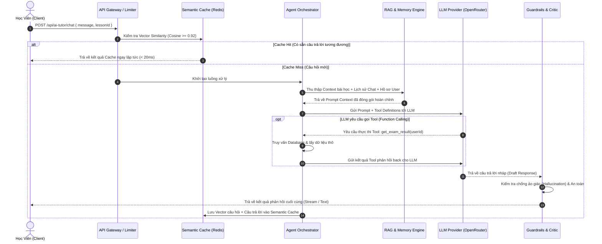
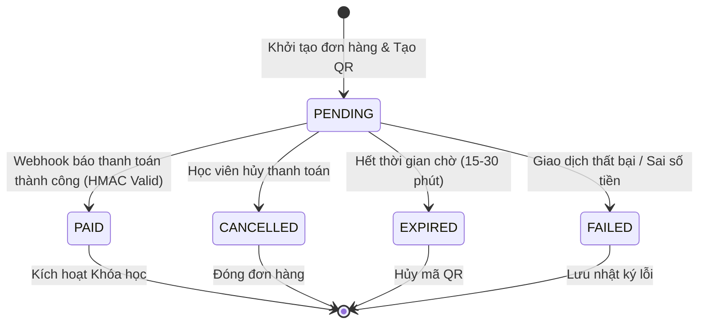

# 🏛️ TÀI LIỆU THIẾT KẾ KIẾN TRÚC KỸ THUẬT NỀN TẢNG AI HERMES & CỔNG THANH TOÁN (LANGUAGE-AGNOSTIC ARCHITECTURE SPECIFICATION)

> **Mục tiêu**: Bóc tách chi tiết từng lớp công nghệ của Nền tảng AI Hermes/Harness và Hệ thống Cổng thanh toán trực tuyến. Thiết kế được trình bày ở dạng **TỔNG QUÁT - ĐỘC LẬP NGÔN NGỮ LẬP TRÌNH (Language-Agnostic)**, giúp tái sử dụng nguyên vẹn kiến trúc cho bất kỳ dự án nào (Node.js/TypeScript, Python, Java, Go, C#/.NET).

---

## 📑 MỤC LỤC
1. [CHUYÊN ĐỀ 1: BÓC TÁCH KIẾN TRÚC NỀN TẢNG AI HERMES (AI AGENT & RAG ARCHITECTURE)](#1-chuyên-đề-1-bóc-tách-kiến-trúc-nền-tảng-ai-hermes-ai-agent--rag-architecture)
   - [1.1 Sơ Đồ Khối Kiến Trúc 8 Lớp (8-Layer Modular AI Platform)](#11-sơ-đồ-khối-kiến-trúc-8-lớp-8-layer-modular-ai-platform)
   - [1.2 Phân Tích Bóc Tách Chi Tiết Từng Lớp Công Nghệ](#12-phân-tích-bóc-tách-chi-tiết-từng-lớp-công-nghệ)
   - [1.3 Nguồn Dữ Liệu Tạo Câu Trả Lời Cho AI Chatbot (Data Sources Mapping)](#13-nguồn-dữ-liệu-tạo-câu-trả-lời-cho-ai-chatbot-data-sources-mapping)
   - [1.4 Luồng Xử Lý Câu Hỏi (End-to-End Sequence Flow)](#14-luồng-xử-lý-câu-hỏi-end-to-end-sequence-flow)
   - [1.5 Bóc Tách Kỹ Thuật: AI Tutor vs AI Hermes/Harness & Ứng Dụng Thực Tế](#15-bóc-tách-kỹ-thuật-ai-tutor-vs-ai-hermesharness--ứng-dụng-thực-tế)
2. [CHUYÊN ĐỀ 2: KỸ THUẬT CỐT LÕI XÂY DỰNG TRANG THANH TOÁN TRỰC TUYẾN (PAYMENT GATEWAY ENGINEERING)](#2-chuyên-đề-2-kỹ-thuật-cốt-lõi-xây-dựng-trang-thanh-toán-trực-tuyến-payment-gateway-engineering)
   - [2.1 Kiến Trúc Cổng Thanh Toán Độc Lập Ngôn Ngữ](#21-kiến-trúc-cổng-thanh-toán-độc-lập-ngôn-ngữ)
   - [2.2 Quy Trình Khởi Tạo Giao Dịch & Tạo Mã QR (EMVCo Standard)](#22-quy-trình-khởi-tạo-giao-dịch--tạo-mã-qr-emvco-standard)
   - [2.3 Kỹ Thuật Xử Lý Webhook An Toàn (HMAC Signature & Idempotency)](#23-kỹ-thuật-xử-lý-webhook-an-toàn-hmac-signature--idempotency)
   - [2.4 Mô Hình Máy Trạng Thái Thanh Toán (Payment State Machine)](#24-mô-hình-máy-trạng-thái-thanh-toán-payment-state-machine)
3. [NGUYÊN TẮC KIẾN TRÚC TÁI SỬ DỤNG, BƯỚC TRIỂN KHAI & PHƯƠNG PHÁP KIỂM THỬ](#3-nguyên-tắc-kiến-trúc-tái-sử-dụng-bước-triển-khai--phương-pháp-kiểm-thử)
   - [3.1 Các Mẫu Kiến Trúc Có Thể Tái Sử Dụng (Universal Patterns)](#31-các-mẫu-kiến-trúc-có-thể-tái-sử-dụng-universal-patterns)
   - [3.2 Quy Trình Các Bước Triển Khai Chi Tiết (Implementation Roadmap)](#32-quy-trình-các-bước-triển-khai-chi-tiết-implementation-roadmap)
   - [3.3 Phương Pháp Kiểm Thử Đa Nền Tảng (Cross-Platform Testing Strategy)](#33-phương-pháp-kiểm-thử-đa-nền-tảng-cross-platform-testing-strategy)

---

## 1. CHUYÊN ĐỀ 1: BÓC TÁCH KIẾN TRÚC NỀN TẢNG AI HERMES (AI AGENT & RAG ARCHITECTURE)

Nền tảng AI Hermes là một **Hệ thống Trợ lý AI Đa tác nhân (Multi-Agent & RAG Platform)** có khả năng hiểu ngữ cảnh bài học, truy xuất tri thức và đưa ra câu trả lời được kiểm duyệt chính xác.

### 1.1 Sơ Đồ Khối Kiến Trúc 8 Lớp (8-Layer Modular AI Platform)

```text
[ Client (Web / Mobile App) ]
              │
              ▼
┌──────────────────────────────────────────────────────────────────┐
│ LỚP 1: API GATEWAY & RATE LIMITER (Thanh lọc Request & Tần suất) │
└──────────────────────────────────────────────────────────────────┘
              │
              ▼
┌──────────────────────────────────────────────────────────────────┐
│ LỚP 2: SEMANTIC CACHE LAYER (Tận dụng câu trả lời tương tự)     │
└──────────────────────────────────────────────────────────────────┘
              │ (Cache Miss)
              ▼
┌──────────────────────────────────────────────────────────────────┐
│ LỚP 3: INTENT ROUTER & MODEL SELECTOR (Phân loại ý định)         │
└──────────────────────────────────────────────────────────────────┘
              │
              ▼
┌──────────────────────────────────────────────────────────────────┐
│ LỚP 4: CONTEXT ASSEMBLY & RAG ENGINE (Thu thập tri thức tĩnh/động)│
└──────────────────────────────────────────────────────────────────┘
              │
              ▼
┌──────────────────────────────────────────────────────────────────┐
│ LỚP 5: MEMORY SYSTEM (Bộ nhớ ngắn hạn Session & Bộ nhớ dài hạn) │
└──────────────────────────────────────────────────────────────────┘
              │
              ▼
┌──────────────────────────────────────────────────────────────────┐
│ LỚP 6: REACT AGENT ORCHESTRATOR & TOOL EXECUTION (Gọi hàm/Tool)   │
└──────────────────────────────────────────────────────────────────┘
              │
              ▼
┌──────────────────────────────────────────────────────────────────┐
│ LỚP 7: LLM PROVIDER ROUTER & FAILOVER CHAIN (Quản lý API Keys)   │
└──────────────────────────────────────────────────────────────────┘
              │
              ▼
┌──────────────────────────────────────────────────────────────────┐
│ LỚP 8: CRITIC, GUARDRAILS & VALIDATOR (Kiểm duyệt sự thật & An toàn)│
└──────────────────────────────────────────────────────────────────┘
              │
              ▼
[ Response Stream / JSON to Client ]
```

---

### 1.2 Phân Tích Bóc Tách Chi Tiết Từng Lớp Công Nghệ

#### 🔹 Lớp 1: API Gateway & Rate Limiter Layer
- **Chức năng**: Ngăn chặn tấn công DoS/DDoS và quản lý quota gọi AI cho từng tài khoản.
- **Cơ chế**: Áp dụng thuật toán **Token Bucket** hoặc **Leaky Bucket** theo Client IP và User Token.
- **Độc lập ngôn ngữ**: Sử dụng Redis In-Memory KV store với key `ratelimit:{user_id}:{endpoint}`.

#### 🔹 Lớp 2: Semantic Cache Layer (Hệ Thống Caching Ngữ Nghĩa)
- **Chức năng**: Nếu hai người dùng hỏi 2 câu có ý nghĩa tương đương (Ví dụ: *"Khóa học này gồm những bài nào?"* và *"Cho mình xem nội dung các bài trong khóa này"*), hệ thống trả về kết quả ngay mà không cần tốn chi phí gọi LLM.
- **Kỹ thuật**:
  1. Chuyển câu hỏi người dùng thành Vector Embedding thông qua mô hình Embedding (`text-embedding-3-small` hoặc `all-MiniLM-L6-v2`).
  2. Tính khoảng cách Cosine Similarity với tập Vector câu hỏi đã lưu trong Redis / Milvus / Qdrant.
  3. Nếu `Cosine Similarity >= 0.92` ➔ Trả về Cache Response ngay lập tức (Thời gian phản hồi < 20ms).

#### 🔹 Lớp 3: Intent Router & Model Selector (Phân Luồng Ý Định)
- **Chức năng**: Phân tích ý định câu hỏi để quyết định dòng mô hình LLM thích hợp (Tối ưu chi phí & tốc độ).
- **Phân loại**:
  - *Ý định chào hỏi/xã giao*: Chuyển tới LLM nhỏ/rẻ (`google/gemini-2.5-flash`, `qwen-flash`).
  - *Ý định cần tư duy sâu/lập trình/giải toán*: Chuyển tới LLM mạnh (`claude-3.5-sonnet`, `deepseek-chat`).
  - *Ý định tra cứu dữ liệu (Tra cứu bài học, điểm số)*: Kích hoạt Lớp Tool Execution.

#### 🔹 Lớp 4: Context Assembly & RAG Engine (Thu Thập Ngữ Cảnh Tĩnh & Động)
- **Chức năng**: Thu thập đầy đủ dữ liệu tri thức cần thiết liên quan tới câu hỏi trước khi gửi cho LLM.
- **Kỹ thuật RAG (Retrieval-Augmented Generation)**:
  1. Chunking nội dung bài học/PDF thành các đoạn văn nhỏ (300-500 tokens).
  2. Tìm kiếm các đoạn tài liệu có liên quan nhất với câu hỏi người dùng (Top-K hybrid search: BM25 + Vector Search).
  3. Đóng gói đoạn tài liệu vào System Prompt ở dạng `<context>...</context>`.

#### 🔹 Lớp 5: Memory System (Bộ Nhớ Ngắn Hạn & Dài Hạn)
- **Short-term Memory (Bộ nhớ ngắn hạn)**:
  - Lưu 10-20 tin nhắn gần nhất trong phiên trò chuyện.
  - Sử dụng cơ chế **Sliding Window với Token Budgeting**: Khi tổng số token vượt ngưỡng 3000 tokens, tự động nén (Summarize) các câu thoại cũ thành đoạn tóm tắt ngắn.
- **Long-term Memory & Adaptive Profile (Bộ nhớ dài hạn)**:
  - Lưu thông tin cố định/dài hạn của người dùng: Trình độ hiện tại, các bài kiểm tra đã trượt, phong cách học tập thích hợp.

#### 🔹 Lớp 6: ReAct Agent Orchestrator & Tool Execution (Điều Phối Agent & Gọi Hàm)
- **Mô hình ReAct (Reasoning + Acting)**:
  1. **Thought (Tư duy)**: AI suy nghĩ cần thực hiện thao tác gì để trả lời.
  2. **Action (Hành động)**: AI quyết định gọi Tool (VD: `get_exam_result(user_id)`, `get_lesson_progress(course_id)`).
  3. **Observation (Quan sát)**: Hệ thống chạy Tool, trả kết quả dữ liệu thô từ Database về cho AI.
  4. **Final Answer (Trả lời)**: AI tổng hợp dữ liệu thô thành câu trả lời thân thiện cho học viên.

#### 🔹 Lớp 7: LLM Provider Router & Fallback Chain (Quản Lý API Key & Failover)
- **Chức năng**: Đảm bảo hệ thống AI không bao giờ sập 100% khi nhà cung cấp (OpenRouter/OpenAI/Anthropic) bị lỗi hoặc nghẽn mạng.
- **Cơ chế**:
  - **Key Rotation**: Xoay vòng danh sách `API_KEYS` theo thuật toán Round-Robin hoặc Least-Used.
  - **Model Fallback Chain**: Nếu Primary Model (`google/gemini-2.5-flash`) bị từ chối hoặc timeout ➔ Tự động chuyển tiếp sang Fallback Model (`deepseek/deepseek-chat`) trong vòng 500ms.

#### 🔹 Lớp 8: Critic, Guardrails & Validator (Kiểm Duyệt Thực Tế & An Toàn)
- **Hallucination Detection (Chống ảo giác)**: Đối chiếu câu trả lời của AI với dữ liệu gốc thu thập từ Lớp RAG. Nếu câu trả lời chứa thông tin mâu thuẫn ➔ Yêu cầu AI tạo lại (Retry).
- **Safety Guardrails**: Lọc từ ngữ độc hại, lộ thông tin cá nhân (PII), hoặc các câu hỏi nằm ngoài phạm vi giáo dục.

---

### 1.3 Nguồn Dữ Liệu Tạo Câu Trả Lời Cho AI Chatbot (Data Sources Mapping)

AI Chatbot không tự nghĩ ra câu trả lời dựa trên tri thức học vẹt suông, mà sử dụng **5 Nguồn Dữ Liệu Chính**:

```text
┌─────────────────────────────────────────────────────────────────────────┐
│                      CÁC NGUỒN DỮ LIỆU CỦA AI CHATBOT                    │
├─────────────────────────────────────────────────────────────────────────┤
│ 1. SYSTEM PROMPT & PERSONA   │ Quy tắc ứng xử, văn phong, định dạng    │
│ 2. DYNAMIC LESSON CONTENT    │ Slide, Video Transcripts, Tài liệu PDF  │
│ 3. CONVERSATION HISTORY      │ 10-20 câu thoại gần nhất trong phiên     │
│ 4. USER ADAPTIVE PROFILE     │ Trình độ học viên, điểm yếu, lịch sử học │
│ 5. REAL-TIME TOOL DATA       │ Tiến độ, điểm thi thực tế từ DB MySQL   │
└─────────────────────────────────────────────────────────────────────────┘
```

| STT | Nguồn Dữ Liệu | Loại Dữ Liệu | Mô Tả & Tác Dụng Trong Câu Trả Lời |
|---|---|---|---|
| **1** | **System Persona & Rules** | Tĩnh (Static) | Định hình tính cách trợ lý AI (Ví dụ: *"Bạn là AI Tutor thân thiện, giải thích ngắn gọn, luôn khuyến khích học viên"*). |
| **2** | **Lesson & Course Context** | Động (Dynamic) | Nội dung video bài giảng, bản dịch transcript, tài liệu PDF của bài học mà học viên đang xem. Giúp AI trả lời chính xác kiến thức của bài học đó. |
| **3** | **Short-term Memory** | Động (Session) | Lịch sử chat của phiên hiện tại. Giúp AI hiểu được các đại từ thay thế như *"nó là gì"*, *"bài đó ở đâu"*. |
| **4** | **User Memory & Profile** | Động (Personalized) | Thông tin trình độ cá nhân của học viên. Giúp AI điều chỉnh độ khó của câu trả lời (Dễ hiểu cho người mới, chuyên sâu cho người nâng cao). |
| **5** | **Real-time Database Tools** | Động (Real-time DB) | Dữ liệu tiến độ học (`lesson_progress`), bảng điểm (`exam_attempts`). Khi học viên hỏi *"Tôi làm bài thi được mấy điểm?"*, AI sẽ gọi Tool truy vấn DB để lấy số liệu thực. |

---

### 1.4 Luồng Xử Lý Câu Hỏi (End-to-End Sequence Flow)



---

### 1.5 Bóc Tách Kỹ Thuật: AI Tutor vs AI Hermes/Harness & Ứng Dụng Thực Tế

#### 1. Bảng So Sánh Kỹ Thuật Lõi (Technical Comparison Matrix)

| Tiêu Chí Kỹ Thuật | 🟢 **AI Tutor** (Trợ Lý Bài Học) | ⚡ **AI Hermes / Harness** (Multi-Agent Engine) |
|---|---|---|
| **Mô Hình LLM (Model Router)** | Mô hình siêu tốc, chi phí thấp (`google/gemini-2.5-flash`, `qwen-flash`). | Đa mô hình thông minh (`Claude 3.5 Sonnet`, `DeepSeek R1`, `GPT-4o`) qua OpenRouter Router. |
| **Phạm Vi Ngữ Cảnh (Scope)** | Khớp theo `lessonId` hiện tại. Thu thập transcript video, slide bài học, PDF khóa học. | Toàn hệ thống. Truy vấn CSDL người dùng, bộ nhớ dài hạn `UserMemory`, bảng điểm thi `exam_attempts`. |
| **Khả Năng Gọi Tool (Function Calling)** | Giới hạn ở các Tool đọc nội dung bài học. | Đầy đủ tập Tool ReAct: `get_exam_result`, `get_user_learning_progress`, `analyze_weak_points`. |
| **Cơ Chế Tính Phí & Quota** | **Miễn phí 100%** cho mọi học viên tham gia khóa học. | **Quản lý Quota**: Miễn phí 10 lượt đầu. Vượt quá sẽ trả về `402 Payment Required` (Yêu cầu mua gói Subscription). |
| **Endpoint Backend** | `/ai-tutor/chat` & `/ai-tutor/stream` | `/ai-harness/chat` & `/ai-harness/stream` |

---

#### 2. Phân Tích Vận Dụng Trong Thực Tế (Practical Application Scenarios)

##### 🔹 Kịch bản 1: Học viên hỏi bài trong lúc đang xem Video bài giảng
* **Vận dụng AI Tutor:** Học viên bấm nút **Chat AI** ngay ở khung bài học để hỏi: *"Đoạn 02:15 thầy giáo nói về `useCallback` là gì vậy?"*.
* **Luồng xử lý:** AI Tutor lấy transcript bài học tại phút `02:15`, trả lời đúng trọng tâm trong vòng < 500ms mà không làm gián đoạn việc học của học viên. Hoàn toàn miễn phí.

##### 🔹 Kịch bản 2: Học viên làm nhiều bài thi trắc nghiệm nhưng hay làm sai
* **Vận dụng AI Hermes / Harness:** Học viên vào trang AI Chuyên sâu hỏi: *"Tại sao dạo này mình làm phần Listening Part 2 TOEIC toàn bị điểm thấp?"*.
* **Luồng xử lý:** AI Hermes chạy mô hình ReAct Agent:
  1. Thao tác gọi Tool `get_exam_attempts(userId)` lấy toàn bộ lịch sử bài làm.
  2. Phân tích thấy học viên sai 80% ở các câu hỏi bẫy thời thì (Past vs Present).
  3. Ghi thông tin điểm yếu này vào bộ nhớ dài hạn `UserMemory`.
  4. Trả về lộ trình khắc phục cá nhân hóa. Quá trình này tiêu tốn 1 lượt Quota của gói AI Hermes.

##### 🔹 Kịch bản 3: Học viên cần giải bài tập tư duy/lập trình độ khó cao
* **Vận dụng AI Hermes / Harness:** Học viên hỏi: *"Viết giúp mình thuật toán sắp xếp nhanh (QuickSort) bằng Java và tối ưu bộ nhớ"*.
* **Luồng xử lý:** AI Hermes tự động phân luồng (Intent Router) chuyển câu hỏi sang mô hình tư duy chuyên sâu (`Claude 3.5 Sonnet` / `DeepSeek R1`) để trả lời chính xác từng dòng code và giải thích chi tiết.

---

## 2. CHUYÊN ĐỀ 2: KỸ THUẬT CỐT LÕI XÂY DỰNG TRANG THANH TOÁN TRỰC TUYẾN (PAYMENT GATEWAY ENGINEERING)

Trang thanh toán trực tuyến là thành phần yêu cầu độ tin cậy, tính toàn vẹn dữ liệu và độ bảo mật cao nhất trong hệ thống.

### 2.1 Kiến Trúc Cổng Thanh Toán Độc Lập Ngôn Ngữ

```text
[ Frontend Payment UI ] ──────────► [ 1. Order Engine (Tạo Đơn)]
                                                │
                                                ▼
[ User Mobile Banking App ] ──────► [ 2. Merchant Integration Layer ]
          │                                     │
          │ (Quét QR & Chuyển tiền)             ▼
          ▼                         [ 3. Dynamic QR Generator (EMVCo) ]
[ Payment Provider (payOS / VNPay) ]            │
          │                                     │
          │ (Gửi Webhook Async)                 ▼
          └───────────────────────► [ 4. Webhook Receiver Engine ]
                                                │
                                                ▼
                                    [ 5. State Machine & Event Listener ]
                                                │
                                                ▼
                                    [ 6. Course Enrollment Kích Hoạt ]
```

---

### 2.2 Quy Trình Khởi Tạo Giao Dịch & Tạo Mã QR (EMVCo Standard)

#### 1. Yêu cầu tạo thanh toán (Create Payment Order):
Frontend gửi yêu cầu tạo giao dịch. Backend thực hiện validate và tạo bản ghi trạng thái `PENDING` trong Database.

**Payload chuẩn hóa (Universal JSON Contract):**
```json
{
  "orderCode": 1711928301,
  "amount": 250000,
  "description": "THINKAI1711928301",
  "items": [
    {
      "name": "Khóa học Next.js Advanced",
      "quantity": 1,
      "price": 250000
    }
  ],
  "returnUrl": "https://thinkai.vn/payment/success",
  "cancelUrl": "https://thinkai.vn/payment/cancel"
}
```

#### 2. Cấu trúc Mã QR Thanh toán chuẩn EMVCo (VietQR / payOS):
Mã QR thanh toán ngân hàng chuyển khoản tự động thực chất là một chuỗi văn bản tuân theo tiêu chuẩn **EMVCo QR Code Specifications**:

```text
00020101021238570010A00000072701270006970422011319038291038190208QRIBFTTA530370454062500005802VN5907THINKAI6007HA NOI62210817THINKAI171192830163047A8F
```

- **ID `00`**: Phiên bản định dạng QR (`01`).
- **ID `38`**: Thông tin Ngân hàng thụ hưởng (Mã BIN ngân hàng + Số tài khoản).
- **ID `54`**: Số tiền giao dịch (`250000`).
- **ID `58`**: Mã quốc gia (`VN`).
- **ID `62`**: Nội dung chuyển khoản/Mã đơn hàng (`THINKAI1711928301`).
- **ID `63`**: Mã kiểm tra checksum CRC-16 để tránh quét sai dữ liệu.

---

### 2.3 Kỹ Thuật Xử Lý Webhook An Toàn (HMAC Signature & Idempotency)

Webhook từ Cổng thanh toán gọi về Server là một luồng bất đồng bộ (Asynchronous Notification). Cần giải quyết **3 Bài Toán Bảo Mật Cốt Lõi**:

#### 🔒 Bài toán 1: Xác Thực Chữ Ký Số HMAC SHA-256 (HMAC Signature Verification)
Tránh trường hợp kẻ gian tự gửi HTTP POST fake tới URL Webhook để kích hoạt khóa học giả mạo.

**Nguyên lý hoạt động (Language-Agnostic Algorithm):**
1. Cổng thanh toán tính mã HMAC signature từ Data Webhook + `CHECKSUM_KEY` bí mật.
2. Server nhận Webhook ➔ Trích xuất toàn bộ trường dữ liệu nhận được.
3. Sắp xếp các trường dữ liệu theo thứ tự bảng chữ cái (Alphabetical sort by Key).
4. Ghép các giá trị thành chuỗi dạng `key1=value1&key2=value2...`.
5. Tính mã HMAC SHA-256 của chuỗi trên với `CHECKSUM_KEY`.
6. So sánh chuỗi vừa tính với chuỗi `signature` nhận được từ Header/Payload. Nếu không khớp ➔ Từ chối ngay lập tức (HTTP status 400 Bad Request).

**Mô tả thuật toán dạng Pseudo-code:**
```text
FUNCTION VerifyWebhookSignature(payloadData, receivedSignature, checksumKey):
    sortedKeys = SORT_ALPHABETICALLY(KEYS(payloadData))
    rawSignatureString = ""
    FOR EACH key IN sortedKeys:
        IF key != "signature":
            rawSignatureString += key + "=" + payloadData[key] + "&"
    END FOR
    rawSignatureString = REMOVE_TRAILING_CHAR(rawSignatureString, "&")
    
    calculatedSignature = HMAC_SHA256(rawSignatureString, checksumKey)
    RETURN (calculatedSignature == receivedSignature)
END FUNCTION
```

---

#### 🔒 Bài toán 2: Tính Kháng Trùng Lặp (Idempotency Handling)
Do sự cố mạng, Cổng thanh toán có thể gửi lặp lại 1 Webhook nhiều lần (Retry policy). Nếu Server xử lý lặp, người dùng có thể bị cộng tiền 2 lần hoặc trùng lặp dữ liệu.

**Nguyên lý xử lý Idempotency:**
1. Tạo một khóa duy nhất (Idempotency Key): Sử dụng `orderCode` hoặc `transactionId`.
2. Trước khi xử lý giao dịch, thực hiện **Atomic Lock** bằng Redis hoặc Database Unique Constraint:
   ```sql
   INSERT INTO payment_transactions (order_code, status) VALUES ('1711928301', 'PROCESSING');
   ```
3. Nếu bản ghi đã tồn tại ➔ Bỏ qua việc xử lý trùng lặp và phản hồi ngay `HTTP 200 OK` cho Cổng thanh toán để dừng retry.

---

#### 🔒 Bài toán 3: Chống Tấn Công Chơi Lại (Replay Attack Protection)
1. Kiểm tra trường `timestamp` trong Payload Webhook.
2. Nếu `abs(currentTime - webhookTimestamp) > 300 seconds` (Vượt quá 5 phút) ➔ Từ chối xử lý.

---

### 2.4 Mô Hình Máy Trạng Thái Thanh Toán (Payment State Machine)

Mọi đơn hàng thanh toán phải chuyển trạng thái theo đúng đồ thị dịch chuyển trạng thái (State Transition Graph) nghiêm ngặt:



---

## 3. NGUYÊN TẮC KIẾN TRÚC TÁI SỬ DỤNG, BƯỚC TRIỂN KHAI & PHƯƠNG PHÁP KIỂM THỬ

### 3.1 Các Mẫu Kiến Trúc Có Thể Tái Sử Dụng (Universal Patterns)

Các mẫu thiết kế kiến trúc này có thể áp dụng nguyên vẹn cho mọi ngôn ngữ lập trình:

#### 1. Pattern 1: Circuit Breaker & Fallback Pattern (Cho Dịch Vụ AI & Thanh Toán)
- Khi nhà cung cấp AI / Cổng thanh toán chính bị sự cố (Tỷ lệ lỗi > 50% trong 1 phút) ➔ Tự động "ngắt mạch" (Open State) và chuyển hướng sang Nhà cung cấp dự phòng (Secondary Provider) mà không gây treo ứng dụng.

#### 2. Pattern 2: Event-Driven Architecture (Kiến Trúc Hướng Sự Kiện)
- Khi Webhook xác nhận thanh toán thành công, Webhook Engine chỉ làm 1 việc duy nhất: Bắn sự kiện `PaymentSuccessEvent(orderCode)`.
- Các dịch vụ độc lập khác sẽ đăng ký lắng nghe (Subscribe) sự kiện này:
  - *Course Service*: Mở quyền truy cập khóa học cho học viên.
  - *Notification Service*: Gửi Email xác nhận đơn hàng và thông báo Push.
  - *Analytics Service*: Cập nhật doanh thu tổng trên Dashboard.

---

### 3.2 Quy Trình Các Bước Triển Khai Chi Tiết (Implementation Roadmap)

```text
GIAI ĐOẠN 1: THIẾT KẾ DATA SCHEMA & API CONTRACTS
  ├── 1. Định nghĩa DB Schemas (users, courses, orders, payments, ai_chat_history)
  └── 2. Thiết kế Swagger/OpenAPI Specs cho AI & Payment API

GIAI ĐOẠN 2: XÂY DỰNG CORE PAYMENT ENGINE
  ├── 3. Triển khai API Tạo đơn hàng & Sinh mã QR EMVCo
  ├── 4. Triển khai Webhook Receiver + Hàm kiểm tra HMAC Signature Verification
  └── 5. Triển khai Idempotency Lock bằng Redis / DB Unique Index

GIAI ĐOẠN 3: XÂY DỰNG CORE AI HERMES ENGINE
  ├── 6. Xây dựng Semantic Cache với Vector Embeddings
  ├── 7. Xây dựng RAG Engine (Chunking, Vector Search & Context Assembly)
  ├── 8. Xây dựng ReAct Agent Orchestrator với Tool Call Support
  └── 9. Triển khai Multi-Model Fallback Router (Gemini -> DeepSeek -> Claude)

GIAI ĐOẠN 4: TÍCH HỢP FRONTEND & DASHBOARD
  ├── 10. Tích hợp QR Code UI + SSE (Server-Sent Events) nhận trạng thái thanh toán
  └── 11. Tích hợp UI AI Tutor Chatbot với Streaming Response
```

---

### 3.3 Phương Pháp Kiểm Thử Đa Nền Tảng (Cross-Platform Testing Strategy)

Để đảm bảo tính tương thích và hoạt động ổn định 100% trên mọi nền tảng, áp dụng chiến lược kiểm thử 4 lớp:

#### 1. Unit Testing (Kiểm thử đơn vị)
- Test hàm tính toán HMAC Signature với dữ liệu mẫu (Sample Dataset) từ payOS/VNPay.
- Test hàm RAG Chunking và Context Truncation với các độ dài văn bản khác nhau.

#### 2. Webhook Simulation & Security Testing (Giả lập Webhook & Kiểm thử Bảo mật)
- **Giả lập Webhook Hợp lệ**: Tạo script POST Webhook chứa HMAC đúng ➔ Kiểm tra đơn hàng đổi sang `PAID` và khóa học được mở.
- **Giả lập Webhook Giả mạo (Fraud Webhook)**: Thay đổi `amount` hoặc `signature` ➔ Kiểm tra hệ thống phải từ chối `400 Bad Request`.
- **Giả lập Replay Attack**: Gửi lại Webhook hợp lệ đã xảy ra cách đây 10 phút ➔ Kiểm tra hệ thống từ chối do quá hạn `timestamp`.

#### 3. Concurrency & Race Condition Testing (Kiểm thử Đồng thời)
- Sử dụng các công cụ kiểm thử tải (Apache JMeter, k6, Locust).
- **Kịch bản**: Gửi đồng thời **100 Webhook giống hệt nhau (Cùng orderCode)** trong thời gian 1 giây.
- **Kết quả kỳ vọng**: Chỉ duy nhất 1 Request xử lý thành công, 99 Request còn lại bị loại bỏ bởi cơ chế Idempotency Lock.

#### 4. Failover & Resilience Testing (Kiểm thử Khả năng Chịu lỗi)
- **Kịch bản**: Ngắt mạng hoặc làm giả lỗi API Key của Model chính (`google/gemini-2.5-flash`).
- **Kết quả kỳ vọng**: Nền tảng AI Hermes tự động phát hiện lỗi và chuyển sang Fallback Model trong thời gian < 500ms mà không trả lỗi cho học viên.

---

<p align="center">
  <b>Tài Liệu Thiết Kế Kiến Trúc Kỹ Thuật ThinkAI - Đã Sẵn Sàng Ứng Dụng Cho Mọi Đồ Án Fullstack & AI! 🚀</b>
</p>
