# CỘNG HÒA XÃ HỘI CHỦ NGHĨA VIỆT NAM
## Độc lập - Tự do - Hạnh phúc
---

# PLT SOLUTIONS

## HỆ THỐNG ĐÀO TẠO TRỰC TUYẾN & GAMIFICATION VƯỜN SỐ KỸ NĂNG
## PLT SKILL GARDEN (PSG)

### TÀI LIỆU ĐẶC TẢ YÊU CẦU PHẦN MỀM (SOFTWARE REQUIREMENTS SPECIFICATION - SRS)

- **Mã tài liệu**: SRS-PLT-PSG-2026
- **Phiên bản**: 2.0 (Fullstack Production Release)
- **Đơn vị phát triển**: PLT Solutions
- **Địa điểm & Thời gian**: TP.Hồ Chí Minh, 09/2026

---

## MỤC LỤC

- [I. RECORD OF CHANGE](#i-record-of-change)
- [II. TỔNG QUAN HỆ THỐNG & YÊU CẦU CHUNG](#ii-tổng-quan-hệ-thống--yêu-cầu-chung)
  - [1. Giới thiệu tổng quan dự án](#1-giới-thiệu-tổng-quan-dự-án)
  - [2. Mục tiêu và phạm vi hệ thống](#2-mục-tiêu-và-phạm-vi-hệ-thống)
  - [3. Đối tượng sử dụng & Các vai trò tác nhân](#3-đối-tượng-sử-dụng--các-vai-trò-tác-nhân)
  - [4. Kiến trúc kỹ thuật và môi trường vận hành](#4-kiến-trúc-kỹ-thuật-và-môi-trường-vận-hành)
  - [5. Yêu cầu phi chức năng (Non-Functional Requirements)](#5-yêu-cầu-phi-chức-năng-non-functional-requirements)
- [III. PHÂN TÍCH HỆ THỐNG PHẦN MỀM](#iii-phân-tích-hệ-thống-phần-mềm)
  - [1. Chức năng Đăng ký tài khoản (UC_Register)](#1-chức-năng-đăng-ký-tài-khoản)
  - [2. Chức năng Đăng nhập & Xác thực (UC_Login)](#2-chức-năng-đăng-nhập)
  - [3. Chức năng Bảng điều khiển Tổng quan Vườn số (UC_Overview)](#3-chức-năng-bảng-điều-khiển)
  - [4. Chức năng Khu Vườn Kỹ Năng 3D & Chăm sóc Cây (UC_SkillGarden)](#4-chức-năng-khu-vườn-kỹ-năng-3d)
  - [5. Chức năng Danh mục Kỹ năng & Gieo mầm Cây mới (UC_SkillCatalog)](#5-chức-năng-danh-mục-kỹ-năng)
  - [6. Chức năng Lộ trình Học tập theo Chặng (UC_LearningPath)](#6-chức-năng-lộ-trình-học-tập)
  - [7. Chức năng Bài học Video LMS & Ghi chú (UC_VideoLearning)](#7-chức-năng-bài-học-video-lms)
  - [8. Chức năng Phòng Quiz Trắc nghiệm Đánh giá (UC_QuizRoom)](#8-chức-năng-phòng-quiz-trắc-nghiệm)
  - [9. Chức năng Mục tiêu Nhiệm vụ & Huy hiệu (UC_GoalsBadges)](#9-chức-năng-mục-tiêu-nhiệm-vụ--huy-hiệu)
  - [10. Chức năng Bảng xếp hạng Thi đua (UC_Leaderboard)](#10-chức-năng-bảng-xếp-hạng)
  - [11. Chức năng Hệ thống Thông báo & Tìm kiếm Header (UC_NotificationSearch)](#11-chức-năng-thông-báo--tìm-kiếm)
  - [12. Chức năng Phê duyệt Tài khoản Học viên Mới (UC_UserApproval)](#12-chức-năng-phê-duyệt-học-viên)
  - [13. Chức năng Quản lý Khóa học & Bài học LMS (UC_CourseManagement)](#13-chức-năng-quản-lý-khóa-học--bài-học)
  - [14. Chức năng Quản lý Loài Cây & Cấu hình Gamification (UC_PlantManagement)](#14-chức-năng-quản-lý-loài-cây--gamification)
  - [15. Chức năng Quản trị Tối cao & Audit Logs (UC_SuperAdmin)](#15-chức-năng-quản-trị-tối-cao--audit-logs)
- [IV. MA TRẬN CHỨC NĂNG (FUNCTIONAL MATRIX)](#iv-ma-trận-chức-năng-functional-matrix)
- [V. PHỤ LỤC & TỪ ĐIỂN THUẬT NGỮ (APPENDIX & GLOSSARY)](#v-phụ-lục--từ-điển-thuật-ngữ)

---

## I. RECORD OF CHANGE

**A - Added | M - Modified | D - Deleted*

| Effective Date | Changed Items | A/M/D | Change Description | New Version |
|---|---|---|---|---|
| 01/08/2026 | Scope & Architecture | A | Khởi tạo dự án PLT Skill Garden: Kiến trúc Fullstack SPA (React 19, TypeScript, Vite) kết hợp Modular Backend REST API (PHP PDO, MySQL). | 1.0 |
| 15/08/2026 | User Approval Flow | A | Bổ sung quy trình kiểm duyệt học viên tân thủ với cờ trạng thái `is_approved = 0`, chuyển hướng trang chờ duyệt `/pending-approval` và tặng 100 XP tân thủ. | 1.1 |
| 01/09/2026 | Gamification 3D Garden | A | Tích hợp thư viện đồ họa 3D Three.js mô phỏng quá trình sinh trưởng của cây qua 5 giai đoạn, tính năng tưới nước tăng độ ẩm, đồng bộ XP và Cấp độ Level (1-10). | 1.2 |
| 15/09/2026 | UI Dark Mode & WCAG 2.1 | M | Chuẩn hóa hệ thống Design System Dark Mode đạt chuẩn WCAG 2.1 AA tương phản cao, tối ưu hiển thị icon đồng trục chữ (inline-flex align-middle). | 1.3 |
| 22/09/2026 | State Synchronization | M | Thống nhất nguồn chân lý XP (`total_xp` từ DB/Store), giải quyết triệt để lỗi double bảng xếp hạng, đồng bộ tự động chặng mở khóa lộ trình học tập 1-5. | 2.0 |

---

## II. TỔNG QUAN HỆ THỐNG & YÊU CẦU CHUNG

### 1. Giới thiệu tổng quan dự án
**PLT Skill Garden (PSG)** là nền tảng học tập trực tuyến (E-Learning LMS) thế hệ mới do **PLT Solutions** nghiên cứu và phát triển. Dự án giải quyết rào cản nhàm chán thường thấy trong các nền tảng giáo dục truyền thống bằng cách kết hợp cơ chế trò chơi hóa (**Gamification**) với biểu tượng "Khu vườn tri thức số". Mỗi kỹ năng công nghệ (React, NestJS, Python, SQL, Cloud...) được đại diện bởi một loài cây ảo. Quá trình tiếp thu kiến thức, xem video bài giảng và hoàn thành bài thi Quiz sẽ đóng vai trò như các hành động "tưới nước", "bón phân" giúp cây kỹ năng của học viên đâm chồi, ra lá và nở hoa rực rỡ trong không gian đồ họa 3D.

### 2. Mục tiêu và phạm vi hệ thống
- **Mục tiêu giáo dục**: Nâng cao tính tự giác và duy trì chuỗi học tập liên tục (**Daily Streak**) thông qua điểm kinh nghiệm (XP), cấp độ (Level 1 - 10) và bảng xếp hạng thành tích thời gian thực.
- **Phạm vi chức năng**:
  - Dành cho Học viên: Đăng ký, đăng nhập, theo dõi dashboard tổng quan, tương tác vườn cây 3D, khám phá danh mục kỹ năng, học theo lộ trình chặng, xem video bài giảng, làm bài kiểm tra trắc nghiệm, nhận nhiệm vụ và huy hiệu danh dự.
  - Dành cho Quản trị viên (Admin LMS): Phê duyệt học viên mới, quản lý khóa học/bài học/ngân hàng câu hỏi quiz, quản lý loài cây và cấu hình điểm thưởng.
  - Dành cho Quản trị viên tối cao (Super Admin): Kiểm soát toàn quyền hệ thống, phân quyền người dùng, theo dõi báo cáo phân tích và giám sát nhật ký an ninh (Audit Logs).

### 3. Đối tượng sử dụng & Các vai trò tác nhân
Hệ thống phân định 4 nhóm tác nhân chính:
1. **Khách vãng lai (Guest)**: Người dùng chưa có tài khoản, được phép xem trang giới thiệu, danh mục kỹ năng mẫu và đăng ký tài khoản mới.
2. **Học viên (User / Student)**: Người học đã đăng ký và được Quản trị viên phê duyệt. Được toàn quyền học tập, tích lũy XP, chăm sóc vườn cây và thi đua bảng xếp hạng.
3. **Quản trị viên Đào tạo (Admin LMS)**: Phụ trách quản lý nội dung học thuật, phê duyệt học viên và kiểm duyệt ngân hàng đề thi.
4. **Quản trị viên Tối cao (Super Admin)**: Quản lý hạ tầng, cấp quyền quản trị và giám sát toàn bộ hoạt động vận hành hệ thống.

### 4. Kiến trúc kỹ thuật và môi trường vận hành
- **Frontend**: Single Page Application (SPA) phát triển trên nền tảng React 19, TypeScript, Vite, Tailwind CSS v4, Lucide Icons, Three.js (WebGL 3D Rendering) và Zustand State Management.
- **Backend**: RESTful API kiến trúc Modular hướng đối tượng trên nền PHP 8.x, PDO Prepared Statements, JWT Token Authentication và mã hóa mật khẩu Bcrypt.
- **Cơ sở dữ liệu**: MySQL / MariaDB với các bảng quan hệ chặt chẽ (`users`, `courses`, `lessons`, `quizzes`, `user_plants`, `badges`, `notifications`, `audit_logs`).
- **Môi trường triển khai**: Tương thích Docker Container, Apache/Nginx Web Server, hỗ trợ SSL/HTTPS chuẩn mã hóa TLS 1.3.

### 5. Yêu cầu phi chức năng (Non-Functional Requirements)
- **Hiệu năng (Performance)**: Thời gian tải trang ban đầu < 1.5 giây. Tốc độ phản hồi các API tra cứu, cộng điểm XP và nộp bài Quiz < 300ms trong điều kiện mạng bình thường.
- **Bảo mật (Security)**:
  - Mật khẩu mã hóa 1 chiều bằng thuật toán `PASSWORD_BCRYPT` với chi phí (cost) tiêu chuẩn.
  - Chống các lỗ hổng OWASP Top 10: Ngăn chặn triệt để SQL Injection bằng PDO Prepared Statements, lọc mã độc XSS qua các lớp tiền xử lý dữ liệu đầu vào.
  - Token JWT được bảo vệ an toàn trên client, kiểm tra chữ ký HMAC-SHA256 trên mỗi request có gắn Authorization Header.
- **Tính khả dụng & Khả năng truy cập (Accessibility & Usability)**: Giao diện đạt chuẩn **WCAG 2.1 AA**, hỗ trợ mượt mà cả hai chế độ sáng/tối (Light/Dark Mode) với độ tương phản cao, thiết kế Responsive thích ứng hoàn hảo từ màn hình di động 360px đến màn hình 4K.
- **Độ tin cậy & Toàn vẹn dữ liệu (Reliability)**: Cơ chế đồng bộ dữ liệu XP kép (Local Cache & Server DB) bảo đảm học viên không bao giờ bị mất điểm tiến độ khi gặp sự cố ngắt quãng mạng.

---

## III. PHÂN TÍCH HỆ THỐNG PHẦN MỀM

---

### 1. Chức năng Đăng ký tài khoản (UC_Register)

#### 1.1. UseCase Đăng ký tài khoản
##### 1.1.1. Use-Case ID
`UC_Register`

##### 1.1.2. Use-Case Name
- Đăng ký tài khoản học viên mới.

##### 1.1.3. Brief Description
- Chức năng cho phép người dùng mới tạo tài khoản học viên trên hệ thống PLT Skill Garden. Người dùng cung cấp Họ và tên, Email, Mật khẩu và Xác nhận mật khẩu. Hệ thống kiểm tra tính hợp lệ của dữ liệu, xác minh email chưa từng được sử dụng. Sau khi gửi đăng ký thành công, tài khoản được lưu vào CSDL với trạng thái `is_approved = 0` (chờ Admin phê duyệt) và tự động chuyển hướng người dùng đến trang "Chờ phê duyệt" (`/pending-approval`).

##### 1.1.4. Flow of Events
**Basic Flow – Đăng ký thành công**:
1. Người dùng truy cập vào trang Đăng ký (`/register`) từ liên kết trên trang Đăng nhập hoặc trang giới thiệu.
2. Hệ thống hiển thị biểu mẫu đăng ký bao gồm:
   - Họ và tên (Full Name)
   - Địa chỉ Email (Email)
   - Mật khẩu (Password) với nút bật/tắt hiển thị mật khẩu (eye toggle)
   - Xác nhận mật khẩu (Confirm Password) với nút bật/tắt hiển thị mật khẩu
   - Nút "Đăng ký tài khoản"
   - Liên kết "Đã có tài khoản? Đăng nhập ngay"
3. Người dùng nhập đầy đủ thông tin hợp lệ:
   - Họ và tên: từ 2 đến 50 ký tự Unicode, không chứa ký tự đặc biệt nguy hiểm.
   - Email: đúng định dạng tiêu chuẩn (RFC 5322), chưa tồn tại trong CSDL.
   - Mật khẩu: tối thiểu 6 ký tự.
   - Xác nhận mật khẩu: trùng khớp hoàn toàn với Mật khẩu.
4. Người dùng nhấn nút "Đăng ký tài khoản".
5. Hệ thống kiểm tra dữ liệu phía máy khách (Client-side validation).
6. Hệ thống gửi yêu cầu HTTP POST đến API `/api/auth/register.php`.
7. Máy chủ tiếp nhận yêu cầu, kiểm tra tính duy nhất của Email trong bảng `users`.
8. Máy chủ thực hiện mã hóa mật khẩu bằng thuật toán Bcrypt (`PASSWORD_BCRYPT`).
9. Máy chủ lưu bản ghi người dùng mới với các giá trị mặc định: `role = 'USER'`, `is_approved = 0`, `total_xp = 0`, `streak_days = 1`, `has_claimed_welcome_xp = 0`.
10. Máy chủ trả về phản hồi thành công (HTTP 201 Created).
11. Client nhận phản hồi và tự động chuyển hướng người dùng đến trang Chờ phê duyệt (`/pending-approval`).
12. Kết thúc Use-Case.

**Alternate Flows**:
- **AF1 – Email đã tồn tại trong hệ thống**:
  1. Tại bước 7, máy chủ phát hiện địa chỉ Email đã được đăng ký trước đó.
  2. Máy chủ trả về mã lỗi HTTP 400 kèm thông điệp: *"Email này đã được sử dụng. Vui lòng chọn email khác hoặc đăng nhập."*
  3. Client hiển thị thông báo lỗi màu đỏ ngay dưới ô nhập Email.
  4. Người dùng chỉnh sửa lại địa chỉ Email và nhấn "Đăng ký tài khoản" để tiếp tục.
- **AF2 – Mật khẩu xác nhận không trùng khớp**:
  1. Tại bước 5, client phát hiện giá trị trường Xác nhận mật khẩu không giống với trường Mật khẩu.
  2. Client hiển thị thông báo lỗi: *"Mật khẩu xác nhận không trùng khớp."*
  3. Hệ thống chặn hành động gửi request lên server và giữ nguyên dữ liệu đã nhập.
  4. Người dùng sửa lại trường Xác nhận mật khẩu.
- **AF3 – Chuyển sang màn hình Đăng nhập**:
  1. Người dùng nhấn vào liên kết "Đã có tài khoản? Đăng nhập ngay".
  2. Hệ thống chuyển hướng người dùng về trang `/login` mà không lưu dữ liệu tạm.

##### 1.1.5. Special Requirements
- Mật khẩu phải luôn được mã hóa 1 chiều bằng Bcrypt trước khi lưu trữ vào CSDL.
- Tích hợp nút icon con mắt (eye toggle) tại cả hai trường mật khẩu để tiện kiểm tra chính tả.
- Thời gian phản hồi của API đăng ký không quá 2 giây trong điều kiện mạng bình thường.
- Giao diện đáp ứng mượt mà (responsive) trên mọi thiết bị di động và máy tính bảng.

##### 1.1.6. Pre-Conditions
- Người dùng chưa đăng nhập vào hệ thống.
- Thiết bị của người dùng có kết nối mạng Internet ổn định.
- Cơ sở dữ liệu của hệ thống đang hoạt động bình thường.

##### 1.1.7. Post-Conditions
- Một bản ghi người dùng mới được tạo trong bảng `users` với trạng thái `is_approved = 0`.
- Người dùng được chuyển đến màn hình thông báo chờ phê duyệt.

##### 1.1.8. Extension Points
- Tự động kích hoạt thông báo Push / Email gửi đến hòm thư Quản trị viên để thông báo có học viên mới cần duyệt.

#### 1.2. Interface

#### 1.3. Workflows
| Scenario | Actor | System |
|---|---|---|
| Đăng ký thành công | 1.1. Nhập Họ tên, Email, Mật khẩu hợp lệ. 1.3. Nhấn nút "Đăng ký tài khoản". | 1.2. Kiểm tra validation form phía client. 1.4. Gửi request POST tới API đăng ký. 1.5. Lưu bản ghi mới vào CSDL với trạng thái `is_approved = 0`. 1.6. Chuyển hướng người dùng sang trang `/pending-approval`. |
| Trùng lặp Email | 2.1. Nhập một Email đã có trong hệ thống. 2.3. Nhấn nút "Đăng ký tài khoản". | 2.2. Kiểm tra CSDL và phát hiện trùng lặp. 2.4. Trả về mã lỗi 400 và hiển thị thông báo đỏ: "Email này đã được sử dụng." |
| Sai khớp Mật khẩu | 3.1. Nhập mật khẩu xác nhận không khớp. 3.3. Nhấn nút "Đăng ký tài khoản". | 3.2. Báo lỗi cục bộ dưới trường Xác nhận mật khẩu. 3.4. Vô hiệu hóa hành động gửi form cho tới khi chỉnh sửa đúng. |

#### 1.4. Screen Description
| No | Field | Control Type | Required | Data Type | Default Value | Description |
|---|---|---|---|---|---|---|
| **Thông tin biểu mẫu** | | | | | | |
| 1 | Banner chào mừng | Visual Container | Không | Visual/Graphic | N/A | Khung hình nền tối bên trái chứa slogan "Nuôi dưỡng kỹ năng công nghệ mỗi ngày" và biểu tượng hạt mầm tri thức. |
| 2 | Họ và tên | Text input | Có | String | Trống | Nhập họ tên đầy đủ của học viên, độ dài từ 2 đến 50 ký tự Unicode. Tự động loại bỏ khoảng trắng đầu/cuối. |
| 3 | Địa chỉ Email | Text input | Có | String (Email) | Trống | Định dạng email hợp lệ (chứa ký tự @ và tên miền hợp lệ). Kiểm tra tính duy nhất trong CSDL. |
| 4 | Mật khẩu | Password input | Có | String | Trống | Tối thiểu 6 ký tự, bảo mật cao. |
| 5 | Eye toggle (Mật khẩu) | Icon Button | Không | Action/Toggle | Ẩn mật khẩu | Chuyển đổi giữa chế độ hiển thị dấu chấm và hiển thị ký tự rõ ràng. |
| 6 | Xác nhận mật khẩu | Password input | Có | String | Trống | Phải trùng khớp tuyệt đối với giá trị đã nhập ở trường Mật khẩu. |
| 7 | Nút "Đăng ký tài khoản" | Primary Button | Có | Action | N/A | Nút màu xanh mầm (Emerald) hoặc tím gradient. Nhấn vào để thực hiện gửi dữ liệu đăng ký. |
| 8 | Liên kết "Đăng nhập ngay" | Hyperlink | Không | Navigation | N/A | Nhấn vào để quay lại màn hình `/login`. |

#### 1.5. Activity Diagram
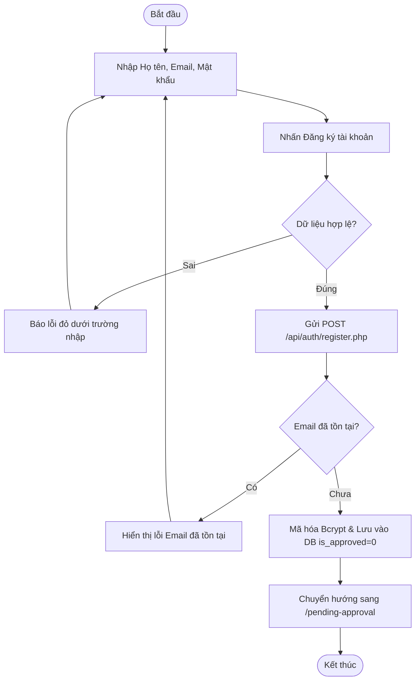

---

### 2. Chức năng Đăng nhập & Xác thực (UC_Login)

#### 2.1. UseCase Đăng nhập & Xác thực
##### 2.1.1. Use-Case ID
`UC_Login`

##### 2.1.2. Use-Case Name
- Đăng nhập và xác thực phiên làm việc.

##### 2.1.3. Brief Description
- Chức năng cho phép người dùng (Học viên, Quản trị viên LMS, Super Admin) đăng nhập vào hệ thống bằng địa chỉ Email và Mật khẩu. Hệ thống xác thực danh tính qua CSDL, kiểm tra trạng thái phê duyệt tài khoản (`is_approved`), cấp quyền truy cập và lưu phiên làm việc (JWT Token / Session) trên trình duyệt, sau đó điều hướng chính xác đến bảng điều khiển tương ứng với vai trò của người dùng.

##### 2.1.4. Flow of Events
**Basic Flow – Đăng nhập thành công**:
1. Người dùng truy cập trang Đăng nhập (`/login`).
2. Hệ thống hiển thị biểu mẫu đăng nhập gồm ô nhập Email, Mật khẩu, checkbox "Ghi nhớ đăng nhập", nút "Vào vườn học ngay" và liên kết "Đăng ký ngay".
3. Người dùng nhập Email và Mật khẩu hợp lệ.
4. Người dùng nhấn nút "Vào vườn học ngay".
5. Hệ thống kiểm tra định dạng dữ liệu phía client và gửi request POST đến `/api/auth/login.php`.
6. Máy chủ kiểm tra tài khoản theo Email trong CSDL.
7. Máy chủ đối soát chuỗi mật khẩu nhập vào với mã hash Bcrypt được lưu trong bảng `users`.
8. Máy chủ kiểm tra cờ trạng thái `is_approved`:
   - Nếu `is_approved == 1` (đã được duyệt): Máy chủ tạo phiên làm việc, cấp JWT Token và trả về thông tin người dùng kèm vai trò (`role`) và cờ `has_claimed_welcome_xp`.
9. Client lưu token và dữ liệu hồ sơ vào Zustand Store (`useAuthStore`) và `localStorage`.
10. Hệ thống điều hướng người dùng dựa vào vai trò:
    - Nếu vai trò là `USER`: Chuyển hướng đến `/dashboard` (Tổng quan vườn số).
    - Nếu vai trò là `ADMIN`: Chuyển hướng đến `/dashboard/admin/approvals` (Quản lý duyệt học viên).
    - Nếu vai trò là `SUPER_ADMIN`: Chuyển hướng đến `/dashboard/superadmin` (Bảng điều khiển tối cao).
11. Kết thúc Use-Case.

**Alternate Flows**:
- **AF1 – Sai địa chỉ Email hoặc Mật khẩu**:
  1. Tại bước 6 hoặc 7, máy chủ không tìm thấy Email hoặc mật khẩu không khớp mã hash.
  2. Máy chủ trả về mã HTTP 401 Unauthorized: *"Email hoặc mật khẩu không chính xác."*
  3. Client hiển thị thông báo lỗi màu đỏ phía trên biểu mẫu đăng nhập để đảm bảo an toàn bảo mật.
  4. Người dùng nhập lại thông tin và thử đăng nhập lại.
- **AF2 – Tài khoản chưa được phê duyệt (`is_approved == 0`)**:
  1. Tại bước 8, máy chủ phát hiện tài khoản có `is_approved == 0`.
  2. Máy chủ phản hồi mã trạng thái 403 Forbidden kèm mã lỗi `PENDING_APPROVAL`.
  3. Client tự động điều hướng người dùng tới trang Thông báo chờ duyệt (`/pending-approval`).
- **AF3 – Đăng nhập nhanh bằng tài khoản Demo**:
  1. Tại màn hình đăng nhập, người dùng nhấn vào nút demo ("Học viên Demo" hoặc "Quản trị Demo").
  2. Hệ thống tự động điền thông tin đăng nhập mẫu và thực hiện đăng nhập trực tiếp.

##### 2.1.5. Special Requirements
- Mọi mật khẩu gửi qua mạng phải thông qua giao thức bảo mật HTTPS/TLS.
- Không lưu mật khẩu ở dạng văn bản thuần trên bất kỳ phần mềm trung gian hoặc cache nào.
- Thời gian xác thực và phản hồi phiên làm việc không vượt quá 1 giây.

##### 2.1.6. Pre-Conditions
- Người dùng đã có tài khoản được khởi tạo trong hệ thống.
- Người dùng chưa có phiên đăng nhập hoạt động hợp lệ trên trình duyệt hiện tại.

##### 2.1.7. Post-Conditions
- Phiên đăng nhập được khởi tạo thành công; thông tin người dùng và token được lưu trữ bền vững.
- Học viên hoặc Quản trị viên được đưa vào đúng không gian làm việc của mình.

##### 2.1.8. Extension Points
- Tích hợp đăng nhập một chạm (Single Sign-On - SSO) qua Google / Microsoft Education.

#### 2.2. Interface

#### 2.3. Workflows
| Scenario | Actor | System |
|---|---|---|
| Đăng nhập thành công (Học viên) | 1.1. Nhập Email và Mật khẩu chính xác. 1.3. Nhấn "Vào vườn học ngay". | 1.2. Kiểm tra định dạng đầu vào. 1.4. Xác thực CSDL qua `/api/auth/login.php`. 1.5. Kiểm tra `is_approved == 1`, trả về Token và vai trò USER. 1.6. Lưu AuthStore và chuyển hướng sang `/dashboard`. |
| Tài khoản chờ duyệt | 2.1. Nhập thông tin tài khoản mới đăng ký. 2.3. Nhấn "Vào vườn học ngay". | 2.2. Phát hiện cờ `is_approved == 0`. 2.4. Chuyển hướng người dùng sang trang `/pending-approval`. |
| Thông tin sai | 3.1. Nhập sai mật khẩu hoặc email chưa đăng ký. 3.3. Nhấn "Vào vườn học ngay". | 3.2. Đối soát mật khẩu thất bại. 3.4. Hiển thị thông báo đỏ: "Email hoặc mật khẩu không chính xác." |

#### 2.4. Screen Description
| No | Field | Control Type | Required | Data Type | Default Value | Description |
|---|---|---|---|---|---|---|
| 1 | Cột thông điệp thương hiệu | Visual Panel | Không | Container | N/A | Khung bên trái trình bày giới thiệu nền tảng Vườn số Skill Garden. |
| 2 | Địa chỉ Email | Text input | Có | String | Trống | Ô nhập email đã đăng ký. Tự động hỗ trợ gợi ý trình duyệt. |
| 3 | Mật khẩu | Password input | Có | String | Trống | Ô nhập mật khẩu có nút eye toggle che/hiện ký tự. |
| 4 | Ghi nhớ đăng nhập | Checkbox | Không | Boolean | Checked | Duy trì trạng thái đăng nhập lâu dài trong `localStorage`. |
| 5 | Nút "Vào vườn học ngay" | Primary Button | Có | Action | N/A | Nút chính gửi request xác thực, đổi sang trạng thái Loading khi xử lý. |
| 6 | Quên mật khẩu? | Hyperlink | Không | Navigation | N/A | Chuyển hướng tới trang khôi phục mật khẩu (`/forgot-password`). |
| 7 | Đăng ký ngay | Hyperlink | Không | Navigation | N/A | Chuyển hướng tới trang tạo tài khoản mới (`/register`). |

#### 2.5. Activity Diagram
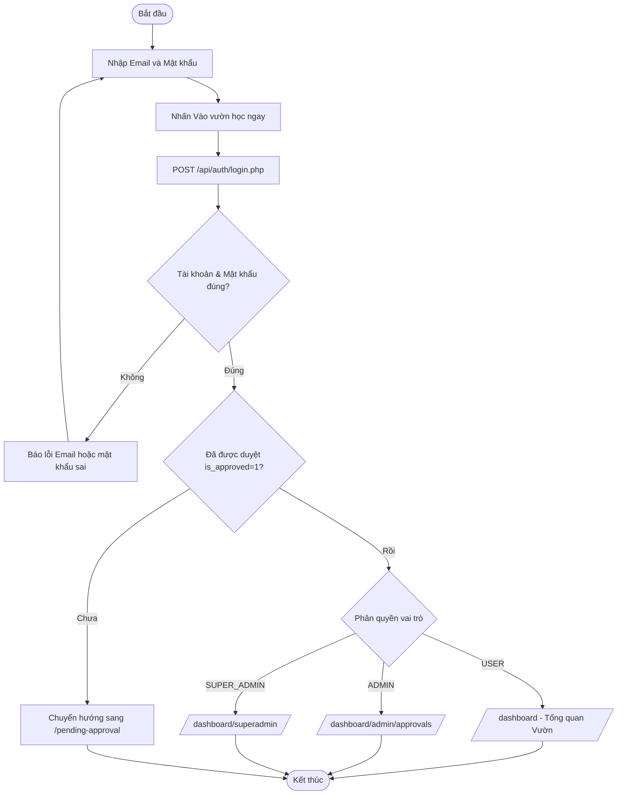

---

### 3. Chức năng Bảng điều khiển Tổng quan Vườn số (UC_Overview)

#### 3.1. UseCase Tổng quan Vườn số
##### 3.1.1. Use-Case ID
`UC_Overview`

##### 3.1.2. Use-Case Name
- Bảng điều khiển Tổng quan Vườn Tri Thức Số.

##### 3.1.3. Brief Description
- Chức năng cung cấp không gian trung tâm theo dõi toàn diện tiến trình học tập và trạng thái khu vườn ảo của học viên. Hệ thống tự động đồng bộ điểm kinh nghiệm (`user.total_xp`), số lượng cây đang phát triển, chuỗi ngày học liên tục (Streak), Cấp độ Level (1 - 10), đồng thời hiển thị Banner chào mừng, Hộp nhận thưởng 100 XP tân thủ (cho học viên mới được duyệt), Widget Khí hậu Vườn số (Buff x1.2 XP) và Danh sách cây trồng đâm chồi cần chăm sóc.

#### 3.2. Interface

#### 3.3. Workflows
| Scenario | Actor | System |
|---|---|---|
| Xem bảng điều khiển | 1.1. Học viên đăng nhập và truy cập `/dashboard`. | 1.2. Tải thông tin cá nhân từ `authStore` và gọi API `getUserGarden()`. 1.3. Tính toán Cấp độ Level bằng công thức chuẩn hóa. 1.4. Hiển thị 4 thẻ chỉ số chính, Banner chào mừng và danh sách cây đang trồng. |
| Nhận thưởng 100 XP Tân thủ | 2.1. Học viên mới nhìn thấy nút "Nhận ngay 100 XP chào mừng". 2.3. Nhấn vào nút nhận thưởng. | 2.2. Kiểm tra điều kiện `has_claimed_welcome_xp == 0`. 2.4. Gọi API cộng 100 XP vào tài khoản, cập nhật trạng thái đã nhận, phát âm thanh chúc mừng và làm mới chỉ số trên toàn màn hình. |

#### 3.4. Screen Description
| No | Field | Control Type | Required | Data Type | Default Value | Description |
|---|---|---|---|---|---|---|
| **Chỉ số cá nhân** | | | | | | |
| 1 | Banner chào mừng | Card Container | Có | Component | N/A | Hiển thị lời chào cá nhân hóa theo tên học viên, ngày tháng hiện tại và thông báo tiến độ. |
| 2 | Card XP Tích lũy | Stat Card | Có | Integer | 0 | Hiển thị tổng số điểm XP tích lũy được từ việc học, quiz, tưới cây và nhiệm vụ. |
| 3 | Card Cây Đang Trồng | Stat Card | Có | Integer | 0 | Thống kê số lượng kỹ năng đã được học viên gieo mầm trong vườn. |
| 4 | Card Chuỗi Streak | Stat Card | Có | Integer | 1 ngày | Số ngày học tập liên tục không bị gián đoạn, kèm biểu tượng ngọn lửa rực cháy. |
| 5 | Card Cấp Độ Level | Stat Card | Có | Integer | Level 1 | Cấp độ học viên từ 1 đến 10 dựa trên tổng số XP hiện có. |
| 6 | Widget Khí Hậu Vườn | Info Widget | Có | Component | Nắng ấm x1.2 XP | Hiển thị trạng thái môi trường giả lập giúp nhân hệ số kinh nghiệm nhận được. |
| 7 | Danh sách Cây cần chăm sóc | Grid Cards | Có | Array | Rỗng | Các loài cây tương ứng với các kỹ năng học viên đã gieo mầm, hiển thị mức độ ẩm và giai đoạn phát triển. |

#### 3.5. Activity Diagram
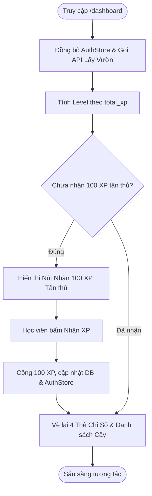

---

### 4. Chức năng Khu Vườn Kỹ Năng 3D & Chăm sóc Cây (UC_SkillGarden)

#### 4.1. UseCase Khu Vườn Kỹ Năng 3D
##### 4.1.1. Use-Case ID
`UC_SkillGarden`

##### 4.1.2. Use-Case Name
- Tương tác Khu Vườn Kỹ Năng 3D & Chăm sóc Cây trồng.

##### 4.1.3. Brief Description
- Cung cấp môi trường không gian 3D tương tác thực tế ảo mô phỏng khu vườn tri thức (sử dụng công nghệ Three.js/Canvas). Mỗi kỹ năng học viên đang học được biểu diễn bởi một loài cây cụ thể với 5 giai đoạn sinh trưởng: Hạt giống -> Chồi non -> Cây nhỏ -> Cây trưởng thành -> Cây đơm hoa. Học viên có thể xoay góc nhìn 360 độ, phóng to/thu nhỏ, chọn từng cây và thực hiện hành động "Tưới nước cho cây" (+15 XP, +20% độ ẩm) để nuôi dưỡng cây phát triển.

#### 4.2. Interface

#### 4.3. Workflows
| Scenario | Actor | System |
|---|---|---|
| Khám phá Vườn 3D | 1.1. Chọn menu "Khu vườn của tôi" (`/dashboard/garden`). | 1.2. Khởi tạo Canvas WebGL 3D. 1.3. Tải danh sách cây và dựng các mô hình 3D tương ứng giai đoạn sinh trưởng. 1.4. Kích hoạt hiệu ứng ánh sáng, mây bay và chuyển động lá cây. |
| Tưới nước cho cây | 2.1. Nhấp chọn một cây kỹ năng trên bãi cỏ 3D. 2.3. Nhấn nút "Tưới nước cho cây 💧". | 2.2. Hiển thị thẻ thông tin cây (loài cây, cấp độ, độ ẩm hiện tại). 2.4. Kích hoạt hiệu ứng hạt nước 3D rơi xuống tán cây. 2.5. Gọi API `/api/garden/water-tree.php`, cộng 15 XP và tăng 20% độ ẩm. |

#### 4.4. Screen Description
| No | Field | Control Type | Required | Data Type | Default Value | Description |
|---|---|---|---|---|---|---|
| 1 | Khung hiển thị 3D | WebGL Canvas | Có | Canvas | N/A | Vùng đồ họa 3D tương tác toàn màn hình, hỗ trợ kéo chuột xoay camera 360 độ và lăn chuột zoom. |
| 2 | Bộ chuyển góc nhìn | Button Group | Không | Action | Góc nhìn tự do | Cho phép chuyển nhanh camera sang các góc nhìn: Toàn cảnh, Cận cảnh, Nhìn từ trên cao. |
| 3 | Thẻ thông tin cây chọn | Modal/Card Overlay | Có | Component | Ẩn | Hiển thị tên kỹ năng, loài cây, cấp độ sinh trưởng và độ ẩm (0 - 100%). |
| 4 | Nút "Tưới nước cho cây 💧" | Primary Button | Có | Action | N/A | Thực hiện tưới nước cho cây đã chọn. Giới hạn tưới theo lượt hồi độ ẩm để chống spam. |
| 5 | Thanh độ ẩm sinh trưởng | Progress Bar | Có | Percent | 50% | Thể hiện mức độ tươi tốt của cây trồng. Cần tưới nước khi độ ẩm giảm xuống dưới 30%. |

#### 4.5. Activity Diagram
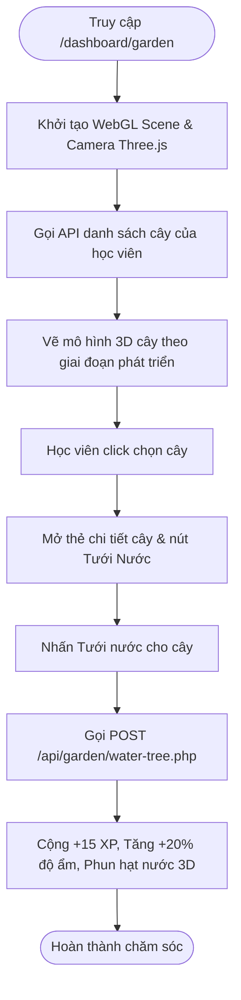

---

### 5. Chức năng Danh mục Kỹ năng & Gieo mầm Cây mới (UC_SkillCatalog)

#### 5.1. UseCase Danh mục Kỹ năng
##### 5.1.1. Use-Case ID
`UC_SkillCatalog`

##### 5.1.2. Use-Case Name
- Khám phá Danh mục Kỹ năng & Gieo mầm Kỹ năng mới.

##### 5.1.3. Brief Description
- Cung cấp danh mục toàn bộ các kỹ năng công nghệ (Frontend React, Backend NestJS, Database SQL, Python AI...). Hệ thống phân loại thông minh trạng thái tương tác của học viên với từng kỹ năng:
  - Nếu học viên chưa từng học kỹ năng này: Nút hành động hiển thị **"Bắt đầu trồng cây này"**. Khi nhấn, hệ thống lưu liên kết kỹ năng vào khu vườn của học viên và điều hướng đến Chặng 1 của lộ trình.
  - Nếu học viên đã gieo mầm kỹ năng: Nút tự động chuyển sang **"Vào học ngay (Học tiếp skill đó)"** dẫn trực tiếp đến chặng bài học đang dang dở.

#### 5.2. Interface

#### 5.3. Workflows
| Scenario | Actor | System |
|---|---|---|
| Trồng cây kỹ năng mới | 1.1. Vào danh mục `/dashboard/skill-catalog` chọn một kỹ năng mới. 1.3. Nhấn "Bắt đầu trồng cây này". | 1.2. Hiển thị nhãn nút mầm xanh tươi sáng. 1.4. Gọi API gieo hạt, thêm cây mầm vào CSDL vườn số. 1.5. Chuyển hướng học viên sang trang Lộ trình học tập (`/dashboard/learning-path/:id`). |
| Học tiếp kỹ năng đã có | 2.1. Chọn kỹ năng đã có cây trong vườn. 2.3. Nhấn "Vào học ngay". | 2.2. Kiểm tra tiến độ học chặng gần nhất. 2.4. Chuyển hướng trực tiếp tới chặng bài học đang học dở. |

#### 5.4. Screen Description
| No | Field | Control Type | Required | Data Type | Default Value | Description |
|---|---|---|---|---|---|---|
| 1 | Thanh tìm kiếm kỹ năng | Text input | Không | String | Trống | Tìm kiếm nhanh theo tên kỹ năng (React, Node, SQL...). |
| 2 | Bộ lọc chuyên ngành | Tab Buttons | Không | String | "Tất cả" | Phân loại theo Frontend, Backend, DevOps, Data Science, AI/ML. |
| 3 | Thẻ Kỹ năng (Skill Card) | Grid Item Card | Có | Component | N/A | Bao gồm: Logo kỹ năng, biểu tượng loài cây đại diện, số lượng bài học, độ khó và mô tả. |
| 4 | Nút hành động động | Dynamic Button | Có | Action | N/A | Tự động đổi trạng thái giữa "Bắt đầu trồng cây này" (chưa trồng) và "Vào học ngay" (đã trồng). |

#### 5.5. Activity Diagram
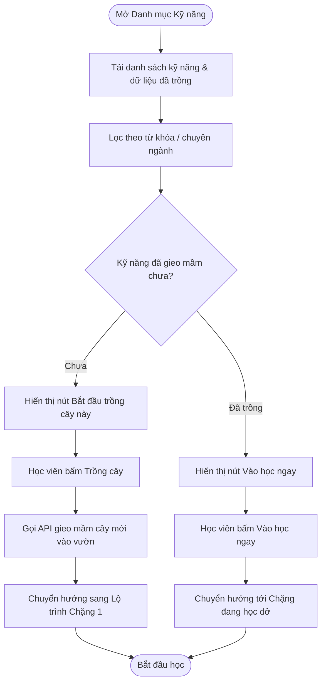

---

### 6. Chức năng Lộ trình Học tập theo Chặng (UC_LearningPath)

#### 6.1. UseCase Lộ trình Học tập
##### 6.1.1. Use-Case ID
`UC_LearningPath`

##### 6.1.2. Use-Case Name
- Lộ trình Học tập theo Chặng (Timeline Stages 1 - 5).

##### 6.1.3. Brief Description
- Quản lý tiến trình học tập của kỹ năng theo mô hình Timeline gồm 5 chặng liên hoàn từ cơ bản đến chuyên sâu. Hệ thống tự động khóa các chặng nâng cao (Chặng 2..5) khi học viên chưa vượt qua chặng trước. Sau khi hoàn thành bài giảng và vượt qua bài Quiz của chặng hiện tại, hệ thống tự động mở khóa chặng tiếp theo, đồng thời cập nhật nút hành động từ "Bắt đầu học" thành "Ôn lại bài học".

#### 6.2. Interface

#### 6.3. Workflows
| Scenario | Actor | System |
|---|---|---|
| Học chặng mới | 1.1. Mở lộ trình kỹ năng. 1.3. Nhấn "Bắt đầu học" tại Chặng 1. | 1.2. Kiểm tra điều kiện mở khóa. 1.4. Mở trang video bài học của chặng (`/dashboard/video-lesson/:id`). |
| Mở khóa chặng kế tiếp | 2.1. Hoàn thành bài Quiz của Chặng 1 đạt điểm yêu cầu (>= 80%). | 2.2. Ghi nhận hoàn thành Chặng 1. 2.3. Tự động chuyển Chặng 2 từ trạng thái "Đang khóa 🔒" sang "Sẵn sàng học 🔓". 2.4. Phát hiệu ứng pháo hoa chúc mừng mở khóa. |

#### 6.4. Screen Description
| No | Field | Control Type | Required | Data Type | Default Value | Description |
|---|---|---|---|---|---|---|
| 1 | Header Kỹ năng | Hero Header | Có | Component | N/A | Tên kỹ năng, cấp độ cây tương ứng và thanh tiến độ tổng thể (0 - 100%). |
| 2 | Nút mốc Chặng (Node) | Circular Badge | Có | Component | N/A | Vòng tròn đánh số 01 đến 05, thể hiện 3 trạng thái: Đã xong (Xanh lá), Đang học (Tím rực rỡ), Khóa (Xám kèm icon ổ khóa). |
| 3 | Thẻ nội dung chặng | Timeline Card | Có | Component | N/A | Tiêu đề chặng, mô tả kiến thức trọng tâm, thời lượng video và số câu hỏi quiz. |
| 4 | Nút tương tác chặng | Action Button | Có | Action | N/A | Đổi trạng thái giữa "Bắt đầu học", "Học tiếp", "Ôn lại bài học" hoặc bị vô hiệu hóa khi chặng đang bị khóa. |

#### 6.5. Activity Diagram
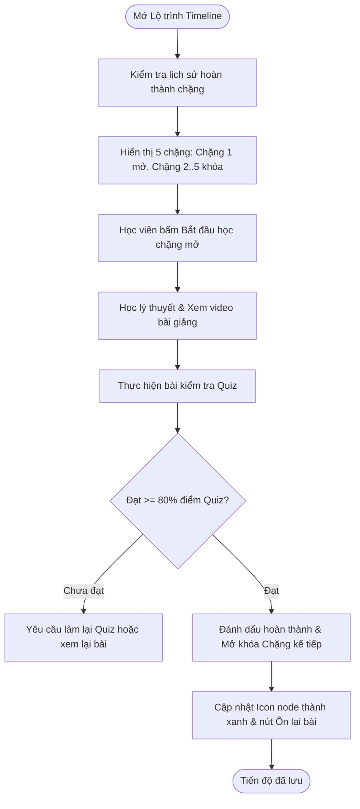

---

### 7. Chức năng Bài học Video LMS & Ghi chú (UC_VideoLearning)

#### 7.1. UseCase Bài học Video LMS
##### 7.1.1. Use-Case ID
`UC_VideoLearning`

##### 7.1.2. Use-Case Name
- Bài học Video LMS kết hợp Ghi chú tương tác.

##### 7.1.3. Brief Description
- Cung cấp trình phát video bài giảng công nghệ chuẩn HD tích hợp khung tài liệu học tập và sổ tay ghi chú trực tiếp. Hệ thống tự động ghi nhận thời lượng xem của học viên. Sau khi hoàn thành video, học viên có thể nhấn nút "Làm Quiz ngay" để chuyển sang phòng kiểm tra kiến thức. Đặc biệt, nếu học viên đã hoàn thành và đạt điểm bài Quiz của bài học này trước đó, nút "Làm Quiz ngay" sẽ tự động ẩn đi và thay thế bằng nhãn "Đã hoàn thành đánh giá".

#### 7.2. Interface

#### 7.3. Workflows
| Scenario | Actor | System |
|---|---|---|
| Xem video bài giảng | 1.1. Chọn bài học trong chặng. 1.3. Nhấn Play xem video. | 1.2. Tải trình phát video HTML5/YouTube Player. 1.4. Theo dõi thanh thời gian xem và ghi nhận tiến độ học tập. |
| Chuyển sang làm Quiz | 2.1. Xem xong nội dung video. 2.3. Nhấn "Làm Quiz ngay". | 2.2. Kiểm tra xem học viên đã từng thi đậu Quiz này chưa. 2.4. Nếu chưa: Điều hướng sang trang `/dashboard/quiz-room/:id` để kiểm tra. |

#### 7.4. Screen Description
| No | Field | Control Type | Required | Data Type | Default Value | Description |
|---|---|---|---|---|---|---|
| 1 | Khung Player Video | Video Player | Có | Media Stream | N/A | Trình phát video chuẩn điều khiển Play/Pause, tua thời gian, toàn màn hình và tốc độ 0.5x - 2.0x. |
| 2 | Tab Nội dung bài học | Tab Panel | Có | Component | Mặc định | Chứa tóm tắt lý thuyết, các đoạn mã code mẫu (syntax highlighting) và tài liệu tham khảo. |
| 3 | Khung Ghi chú cá nhân | Textarea + Button | Không | Text | Trống | Nơi học viên ghi lại các kiến thức quan trọng khi đang xem video và lưu vào hồ sơ cá nhân. |
| 4 | Nút "Làm Quiz ngay" | Primary Button | Có | Action | N/A | Tự động xuất hiện khi bài quiz chưa hoàn thành; tự động ẩn khi học viên đã thi đậu bài quiz của chặng này. |

#### 7.5. Activity Diagram
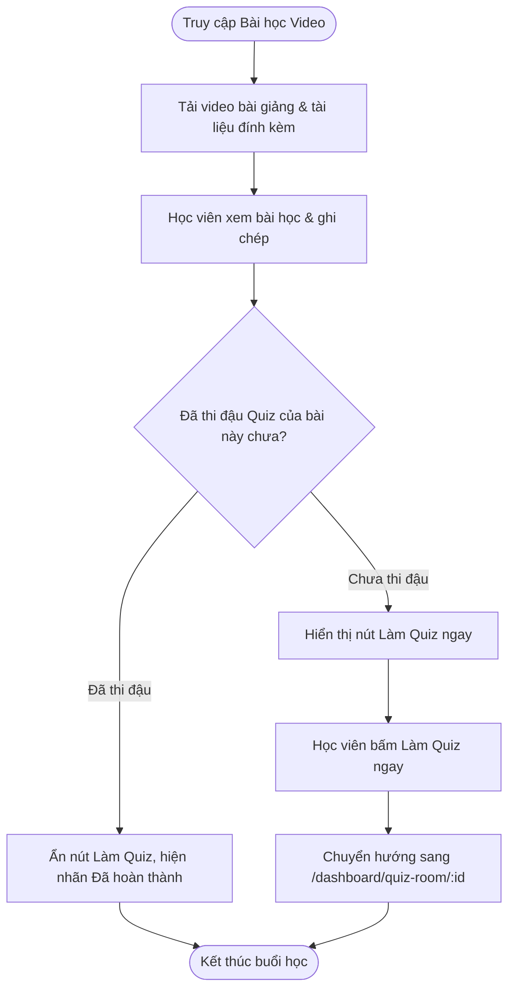

---

### 8. Chức năng Phòng Quiz Trắc nghiệm Đánh giá (UC_QuizRoom)

#### 8.1. UseCase Phòng Quiz Trắc nghiệm
##### 8.1.1. Use-Case ID
`UC_QuizRoom`

##### 8.1.2. Use-Case Name
- Phòng Kiểm tra Trắc nghiệm & Đánh giá năng lực.

##### 8.1.3. Brief Description
- Cung cấp môi trường kiểm tra trắc nghiệm tương tác với đồng hồ đếm ngược thời gian làm bài. Mỗi câu hỏi gồm 4 phương án lựa chọn A, B, C, D. Hệ thống kiểm tra tức thì câu trả lời đúng/sai, giải thích chi tiết đáp án chuẩn, tự động cộng điểm kinh nghiệm (+10 XP cho mỗi câu đúng và thưởng thêm +50 XP khi đạt điểm tuyệt đối). Kết thúc bài thi, hệ thống hiển thị màn hình vinh danh kết quả và cập nhật tiến độ mở khóa chặng tiếp theo.

#### 8.2. Interface

#### 8.3. Workflows
| Scenario | Actor | System |
|---|---|---|
| Làm bài Quiz thành công | 1.1. Đọc câu hỏi và chọn đáp án. 1.3. Nhấn "Xác nhận câu trả lời". 1.5. Nhấn "Câu tiếp theo" cho đến hết bài. | 1.2. Đổi màu nút: Xanh lá nếu đúng, Đỏ nếu sai kèm giải thích. 1.4. Tự động cộng điểm XP tích lũy. 1.6. Hiển thị Popup vinh danh kết quả tổng thể và lưu vào CSDL. |
| Thi lại cải thiện điểm | 2.1. Nhấn nút "Làm lại bài Quiz" tại màn hình kết quả. | 2.2. Xáo trộn lại thứ tự câu hỏi và phương án, đặt lại điểm số và đồng hồ về ban đầu. |

#### 8.4. Screen Description
| No | Field | Control Type | Required | Data Type | Default Value | Description |
|---|---|---|---|---|---|---|
| 1 | Đồng hồ đếm ngược | Timer Badge | Có | Time (MM:SS) | 05:00 | Đếm ngược thời gian làm bài, tự động nộp bài khi thời gian về 00:00. |
| 2 | Thanh tiến độ câu hỏi | Progress Bar | Có | Percent | 0% | Thể hiện số câu đã làm trên tổng số câu hỏi (ví dụ: Câu 3 / 10). |
| 3 | Nội dung câu hỏi | Card Text | Có | String | N/A | Câu hỏi trắc nghiệm kiến thức chuyên môn, có thể kèm đoạn code ví dụ minh họa. |
| 4 | Danh sách 4 đáp án | Grid Option Buttons | Có | Array (A, B, C, D) | N/A | Các nút lựa chọn đáp án; phản hồi đổi màu xanh (đúng) hoặc đỏ (sai) ngay sau khi gửi. |
| 5 | Khung giải thích kiến thức | Info Alert | Không | String | Ẩn | Xuất hiện ngay sau khi chọn đáp án, giải thích chi tiết lý do đúng/sai cho học viên. |
| 6 | Popup Tổng kết kết quả | Modal Dialog | Có | Component | Ẩn | Xuất hiện sau câu cuối cùng: Tỷ lệ chính xác (%), Số XP nhận được, Huy hiệu đạt được. |

#### 8.5. Activity Diagram
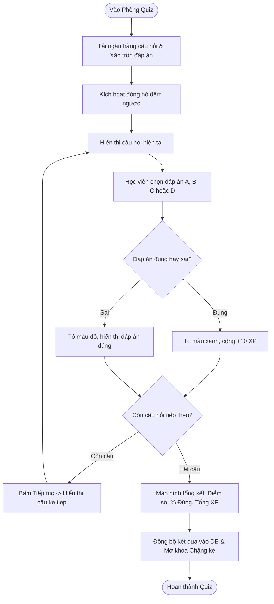

---

### 9. Chức năng Mục tiêu Nhiệm vụ & Huy hiệu (UC_GoalsBadges)

#### 9.1. UseCase Mục tiêu & Huy hiệu
##### 9.1.1. Use-Case ID
`UC_GoalsBadges`

##### 9.1.2. Use-Case Name
- Mục tiêu Nhiệm vụ hàng ngày & Bộ sưu tập Huy hiệu.

##### 9.1.3. Brief Description
- Quản lý hệ thống động lực gamification của học viên. Bao gồm:
  - Danh sách nhiệm vụ ngày / tuần (Tưới cây 1 lần, Hoàn thành 1 bài Quiz, Giữ streak 3 ngày...). Khi hoàn thành nhiệm vụ, nút **"Nhận thưởng"** sáng lên cho phép học viên nhận điểm XP thưởng và đồng bộ tức thì lên thanh Header và Dashboard.
  - Bộ sưu tập Huy hiệu thành tích (Tân thủ xanh lá, Nông dân chăm chỉ, Chuyên gia React, Cột mốc 1000 XP...). Huy hiệu chưa đạt sẽ hiển thị màu xám mờ; khi đạt điều kiện sẽ tự động mở khóa và hiển thị rực rỡ kèm ngày cấp.

#### 9.2. Interface

#### 9.3. Workflows
| Scenario | Actor | System |
|---|---|---|
| Nhận thưởng nhiệm vụ | 1.1. Vào trang `/dashboard/goals-badges` xem nhiệm vụ đã hoàn thành 100%. 1.3. Nhấn nút "Nhận thưởng" (+50 XP). | 1.2. Kiểm tra trạng thái nhiệm vụ. 1.4. Gọi hàm `addStudentXp()`, cập nhật `user.total_xp`, phát sự kiện `skillgarden_xp_updated` và đổi trạng thái nút thành "Đã nhận". |
| Chiêm ngưỡng Huy hiệu | 2.1. Chuyển sang Tab "Bộ sưu tập Huy hiệu". 2.3. Nhấp vào một huy hiệu đã mở khóa. | 2.2. Tải danh sách huy hiệu từ CSDL. 2.4. Hiển thị Popup chi tiết ý nghĩa huy hiệu, ngày đạt được và tỷ lệ học viên toàn hệ thống đạt được huy hiệu đó. |

#### 9.4. Screen Description
| No | Field | Control Type | Required | Data Type | Default Value | Description |
|---|---|---|---|---|---|---|
| 1 | Tab chuyển chế độ | Tabs Component | Có | Enum | "Nhiệm vụ" | Chuyển đổi giữa 2 chế độ: "Nhiệm vụ mục tiêu" và "Bộ sưu tập Huy hiệu". |
| 2 | Danh sách Nhiệm vụ ngày | List Items Card | Có | Array | N/A | Mỗi nhiệm vụ gồm: Tên, thanh tiến độ thực hiện (ví dụ: 1/1), phần thưởng XP (+30 XP) và nút nhận thưởng. |
| 3 | Nút "Nhận thưởng" | Action Button | Có | Action | N/A | Nút màu xanh mầm rực rỡ khi hoàn thành nhiệm vụ; chuyển sang xám nhạt "Đã nhận" sau khi click. |
| 4 | Lưới Huy hiệu thành tích | Grid Badges | Có | Array | N/A | Lưới biểu tượng huy hiệu bo tròn ánh kim loại 3D, phân loại theo cấp độ: Đồng, Bạc, Vàng, Kim Cương. |

#### 9.5. Activity Diagram
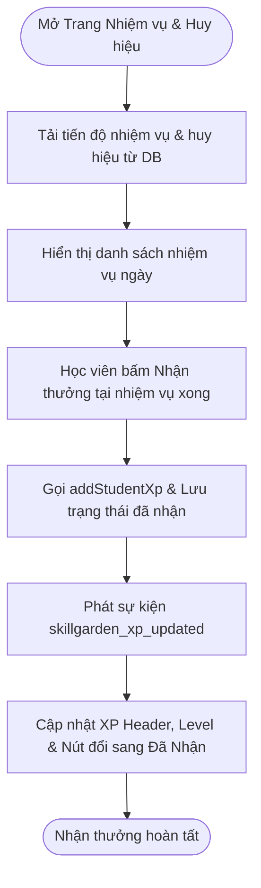

---

### 10. Chức năng Bảng xếp hạng Thi đua (UC_Leaderboard)

#### 10.1. UseCase Bảng xếp hạng
##### 10.1.1. Use-Case ID
`UC_Leaderboard`

##### 10.1.2. Use-Case Name
- Bảng xếp hạng Vinh danh Học viên toàn nền tảng.

##### 10.1.3. Brief Description
- Cung cấp bảng xếp hạng học tập thi đua thời gian thực trên toàn hệ thống Skill Garden. Danh sách được sắp xếp tự động theo tiêu chí: `ORDER BY total_xp DESC, streak_days DESC`. Hiển thị bục vinh danh Top 3 (Quán quân Cúp Vàng, Á quân Bạc, Quý quân Đồng) với hiệu ứng hào quang lộng lẫy. Hệ thống áp dụng cơ chế tự động đối soát nhận diện người dùng hiện tại (bằng ID, UUID, Email và Username) để ghim dòng của tài khoản hiện tại mà tuyệt đối không bị lỗi nhân bản (duplicate) tài khoản.

#### 10.2. Interface

#### 10.3. Workflows
| Scenario | Actor | System |
|---|---|---|
| Xem bảng xếp hạng | 1.1. Truy cập `/dashboard/leaderboard`. | 1.2. Gọi API `/api/leaderboard/index.php`. 1.3. Sắp xếp danh sách theo XP và Streak. 1.4. Hiển thị bục Podium Top 3 và bảng danh sách chi tiết các thứ hạng tiếp theo. 1.5. Highlight dòng vị trí xếp hạng của tài khoản đang đăng nhập. |
| Lọc theo chu kỳ | 2.1. Nhấp chọn tab "Tuần này" hoặc "Toàn thời gian". | 2.2. Lọc và tính toán lại thứ hạng theo mốc thời gian đã chọn. |

#### 10.4. Screen Description
| No | Field | Control Type | Required | Data Type | Default Value | Description |
|---|---|---|---|---|---|---|
| 1 | Bục vinh danh Podium Top 3 | Visual Podium | Có | Component | N/A | Bục 3 bậc: Vị trí 1 (ở giữa, cao nhất, Cúp vàng), Vị trí 2 (bên trái, Bạc), Vị trí 3 (bên phải, Đồng). |
| 2 | Thẻ vị trí của bạn | Sticky Bar | Có | Component | N/A | Khung ghim nổi bật thể hiện: Hạng hiện tại của bạn, Avatar, Tên, Cấp độ Level, Chuỗi Streak và Tổng XP. |
| 3 | Bảng chi tiết thứ hạng | Data Table | Có | Array | N/A | Các cột: Thứ hạng (#), Học viên, Cây chủ đạo, Cấp độ, Chuỗi Streak và Tổng XP. |
| 4 | Bộ lọc thời gian | Pill Switcher | Có | Enum | "Toàn thời gian" | Các tùy chọn: "Hôm nay", "Tuần này", "Tháng này", "Tất cả thời gian". |

#### 10.5. Activity Diagram
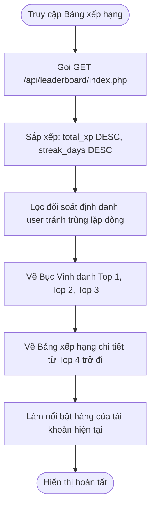

---

### 11. Chức năng Hệ thống Thông báo & Tìm kiếm Header (UC_NotificationSearch)

#### 11.1. UseCase Thông báo & Tìm kiếm
##### 11.1.1. Use-Case ID
`UC_NotificationSearch`

##### 11.1.2. Use-Case Name
- Popover Thông báo & Thanh Tìm kiếm Nhanh trên Header.

##### 11.1.3. Brief Description
- Tích hợp 2 tiện ích trọng yếu trên thanh điều hướng đầu trang (Global Header):
  - **Hộp thông báo (Notification Popover)**: Hiển thị danh sách thông báo hệ thống (Duyệt tài khoản, Nhận thưởng XP, Nhắc nhở tưới cây, Mở khóa chặng mới). Có badge đỏ báo số lượng tin chưa đọc và nút "Đánh dấu tất cả đã đọc".
  - **Thanh tìm kiếm thông minh (Global Search)**: Cho phép học viên gõ từ khóa để tra cứu tức thì các khóa học, kỹ năng và bài học video trong toàn hệ thống với cơ chế gợi ý tự động (Autocomplete Dropdown).

#### 11.2. Interface

#### 11.3. Workflows
| Scenario | Actor | System |
|---|---|---|
| Xem thông báo mới | 1.1. Nhấp vào icon chuông trên Header. 1.3. Nhấp vào một tin thông báo. | 1.2. Mở Popover danh sách 5 thông báo mới nhất. 1.4. Đánh dấu tin đã đọc, giảm badge đỏ và điều hướng đến tính năng tương ứng. |
| Tìm kiếm bài học nhanh | 2.1. Gõ từ khóa "React Hooks" vào ô tìm kiếm trên Header. 2.3. Nhấp vào kết quả hiển thị đầu tiên. | 2.2. Lọc tức thì trong danh sách bài học và hiển thị dropdown danh sách khớp. 2.4. Mở trực tiếp bài học video `/dashboard/video-lesson/:id`. |

#### 11.4. Screen Description
| No | Field | Control Type | Required | Data Type | Default Value | Description |
|---|---|---|---|---|---|---|
| 1 | Ô nhập tìm kiếm Header | Search Input | Không | String | Trống | Ô tìm kiếm có icon kính lúp, hỗ trợ phím tắt `Ctrl + K` để mở nhanh. |
| 2 | Dropdown kết quả tìm kiếm | Dropdown List | Không | Array | Ẩn | Hiển thị danh sách các kỹ năng và bài học khớp với từ khóa tìm kiếm. |
| 3 | Nút Chuông thông báo | Icon Button | Có | Action | N/A | Icon chiếc chuông có kèm Badge đỏ đếm số thông báo mới chưa đọc. |
| 4 | Popover danh sách thông báo | Popover Panel | Không | Component | Ẩn | Khung nổi chứa danh sách tin nhắn, nút "Đánh dấu đã đọc" và nút "Xem tất cả". |

#### 11.5. Activity Diagram
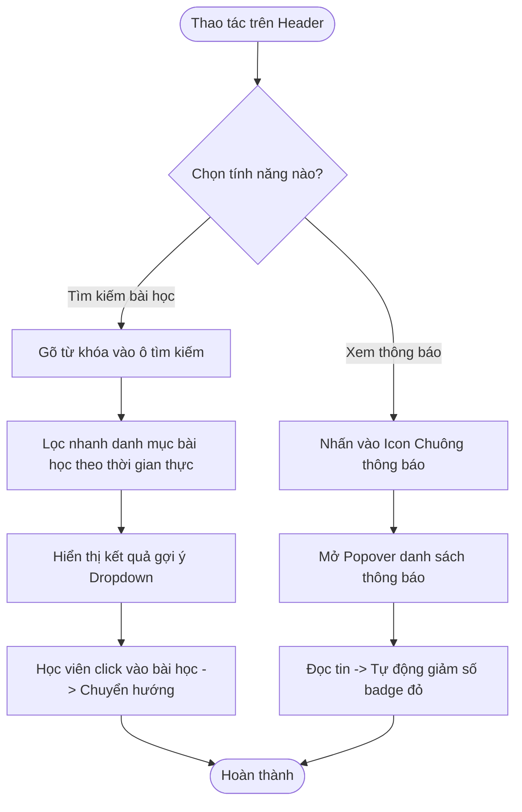

---

### 12. Chức năng Phê duyệt Tài khoản Học viên Mới (UC_UserApproval)

#### 12.1. UseCase Phê duyệt Học viên
##### 12.1.1. Use-Case ID
`UC_UserApproval`

##### 12.1.2. Use-Case Name
- Phê duyệt Tài khoản Học viên Mới (Dành cho Quản trị viên).

##### 12.1.3. Brief Description
- Cung cấp giao diện quản trị dành riêng cho vai trò Admin và Super Admin để kiểm soát học viên mới gia nhập hệ thống. Danh sách hiển thị các học viên đang có trạng thái `is_approved = 0`. Quản trị viên có quyền:
  - **Phê duyệt (Approve)**: Chuyển cờ `is_approved = 1`, cho phép học viên chính thức đăng nhập vào hệ thống và kích hoạt quyền nhận gói thưởng 100 XP tân thủ.
  - **Từ chối / Xóa (Reject/Delete)**: Loại bỏ hồ sơ đăng ký không hợp lệ khỏi hệ thống.

#### 12.2. Interface

#### 12.3. Workflows
| Scenario | Actor | System |
|---|---|---|
| Phê duyệt học viên | 1.1. Quản trị viên truy cập `/dashboard/admin/approvals`.. 1.3. Nhấn nút "Phê duyệt" tại dòng học viên mới. | 1.2. Hiển thị danh sách các tài khoản đang chờ duyệt. 1.4. Gọi API cập nhật `is_approved = 1` trong bảng `users`. 1.5. Gửi thông báo thành công và xóa dòng khỏi danh sách chờ. |
| Từ chối học viên | 2.1. Nhấn nút "Từ chối" tại dòng tài khoản spam. 2.3. Xác nhận trên hộp thoại cảnh báo. | 2.2. Hiển thị hộp thoại xác nhận. 2.4. Xóa bản ghi tài khoản khỏi CSDL. |

#### 12.4. Screen Description
| No | Field | Control Type | Required | Data Type | Default Value | Description |
|---|---|---|---|---|---|---|
| 1 | Tiêu đề trang & Thống kê | Header Text | Có | Component | N/A | Tên trang kèm số lượng học viên đang xếp hàng chờ duyệt. |
| 2 | Bảng học viên chờ duyệt | Data Table | Có | Array | N/A | Các cột: STT, Ảnh đại diện, Họ và tên, Email đăng ký, Thời gian đăng ký, Hành động. |
| 3 | Nút "Phê duyệt" | Success Button | Có | Action | N/A | Nút màu xanh lá; khi nhấn sẽ kích hoạt tài khoản hoạt động. |
| 4 | Nút "Từ chối" | Danger Button | Có | Action | N/A | Nút màu đỏ; khi nhấn sẽ hủy bỏ yêu cầu đăng ký của học viên. |

#### 12.5. Activity Diagram
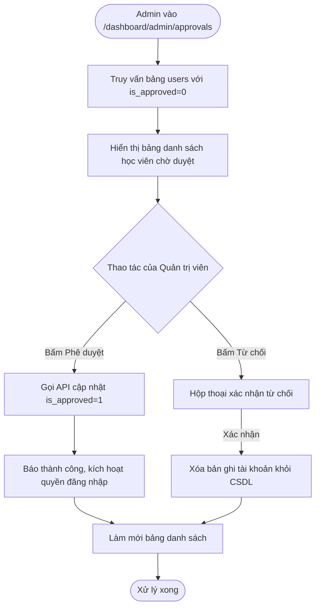

---

### 13. Chức năng Quản lý Khóa học & Bài học LMS (UC_CourseManagement)

#### 13.1. UseCase Quản lý Khóa học & Bài học
##### 13.1.1. Use-Case ID
`UC_CourseManagement`

##### 13.1.2. Use-Case Name
- Quản lý Khóa học & Bài học LMS (Dành cho Quản trị viên).

##### 13.1.3. Brief Description
- Cung cấp các công cụ quản trị nội dung giáo dục số cho Admin. Cho phép tạo mới, chỉnh sửa thông tin, sắp xếp thứ tự và cấu hình các khóa học công nghệ. Trong mỗi khóa học, Admin có thể quản lý các bài học video, tải lên tài liệu đính kèm dạng PDF và liên kết ngân hàng đề thi trắc nghiệm Quiz tương ứng cho từng chặng học tập.

#### 13.2. Interface

#### 13.3. Workflows
| Scenario | Actor | System |
|---|---|---|
| Tạo mới khóa học | 1.1. Nhấn nút "+ Thêm khóa học mới". 1.3. Nhập Tên khóa, Mô tả, Chọn loài cây đại diện và upload ảnh thumbnail. 1.5. Nhấn "Lưu khóa học". | 1.2. Mở biểu mẫu nhập liệu. 1.4. Kiểm tra hợp lệ dữ liệu. 1.6. Lưu thông tin vào bảng `courses` và làm mới danh sách. |
| Thêm video bài học | 2.1. Chọn một khóa học và vào mục "Quản lý bài học". 2.3. Nhập tiêu đề bài giảng, dán URL video và chọn chặng học (1..5). 2.5. Nhấn "Thêm bài học". | 2.2. Hiển thị form bài giảng. 2.4. Kiểm tra định dạng URL video. 2.6. Thêm bản ghi vào bảng `lessons` liên kết với khóa học. |

#### 13.4. Screen Description
| No | Field | Control Type | Required | Data Type | Default Value | Description |
|---|---|---|---|---|---|---|
| 1 | Nút "+ Thêm khóa học" | Primary Button | Có | Action | N/A | Mở Modal / Trang tạo khóa học mới. |
| 2 | Bảng danh sách khóa học | Data Table | Có | Array | N/A | Các cột: ID, Ảnh bìa, Tên khóa học, Chuyên ngành, Số bài học, Trạng thái và Thao tác (Sửa/Xóa). |
| 3 | Form nhập chi tiết khóa học | Modal Form | Có | Component | Ẩn | Các trường: Tên khóa, Mô tả chi tiết, Icon cây đại diện, Cấp độ khó và Thứ tự hiển thị. |
| 4 | Trình quản lý bài học con | Nested View | Có | Component | N/A | Danh sách các video bài học phân theo từng chặng (Stage 1..5) thuộc khóa học. |

#### 13.5. Activity Diagram
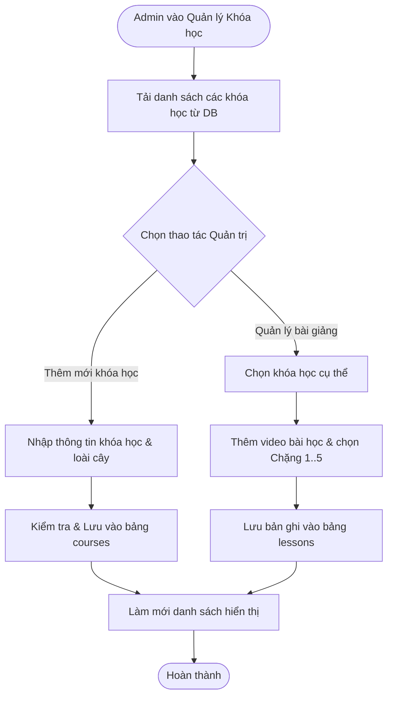

---

### 14. Chức năng Quản lý Loài Cây & Cấu hình Gamification (UC_PlantManagement)

#### 14.1. UseCase Quản lý Loài Cây & Gamification
##### 14.1.1. Use-Case ID
`UC_PlantManagement`

##### 14.1.2. Use-Case Name
- Quản lý Loài Cây & Cấu hình Hệ Thống Gamification.

##### 14.1.3. Brief Description
- Chức năng cho phép Quản trị viên quản lý kho hạt giống thực vật ảo trong hệ sinh thái Skill Garden. Admin có thể định nghĩa các loài cây mới (Cây Sồi Trí Thức, Cây Cọ Linh Hoạt, Hoa Sen Thuật Toán...), gán loài cây tương ứng cho các danh mục kỹ năng, cấu hình 5 giai đoạn hình ảnh / mô hình 3D, điều chỉnh lượng nước tiêu thụ và thiết lập các hệ số thưởng điểm kinh nghiệm (XP Multiplier).

#### 14.2. Interface

#### 14.3. Workflows
| Scenario | Actor | System |
|---|---|---|
| Thêm mới loài cây | 1.1. Nhấn nút "Thêm loài cây mới". 1.3. Nhập tên cây, mô tả, tải lên 5 mốc hình ảnh sinh trưởng. 1.5. Nhấn "Lưu loài cây". | 1.2. Mở form cấu hình cây trồng. 1.4. Kiểm tra hợp lệ file ảnh 3D/2D. 1.6. Lưu bản ghi vào bảng `plants` trong CSDL. |
| Cấu hình điểm thưởng XP | 2.1. Truy cập mục cấu hình Gamification. 2.3. Điều chỉnh hệ số: Xem video (+20 XP), Quiz (+10 XP), Tưới cây (+15 XP). 2.5. Nhấn "Cập nhật cấu hình". | 2.2. Hiển thị bảng tham số điểm thưởng. 2.4. Lưu tham số vào cấu hình hệ thống toàn cục. |

#### 14.4. Screen Description
| No | Field | Control Type | Required | Data Type | Default Value | Description |
|---|---|---|---|---|---|---|
| 1 | Lưới danh sách loài cây | Grid Cards | Có | Array | N/A | Trình bày các loài cây đang hoạt động trong vườn ảo kèm ảnh minh họa và kỹ năng liên kết. |
| 2 | Nút "Thêm loài cây mới" | Primary Button | Có | Action | N/A | Kích hoạt cửa sổ thêm mới cây vào hệ thống. |
| 3 | Khung cấu hình 5 giai đoạn | Multi-upload | Có | Component | N/A | Khu vực tải lên hình ảnh/mô hình tương ứng 5 giai đoạn: Hạt giống, Chồi, Cây non, Trưởng thành, Nở hoa. |
| 4 | Tham số kinh nghiệm XP | Numeric inputs | Có | Integer | Chuẩn | Ô điều chỉnh số điểm XP được cộng cho mỗi hành động học tập và chăm sóc. |

#### 14.5. Activity Diagram
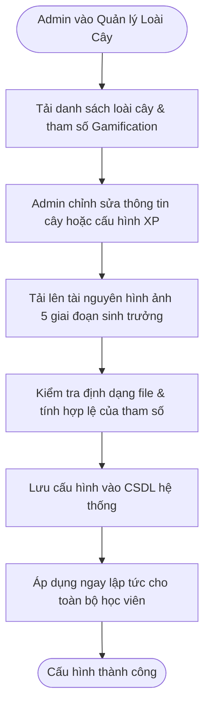

---

### 15. Chức năng Quản trị Tối cao & Audit Logs (UC_SuperAdmin)

#### 15.1. UseCase Quản trị Tối cao & Audit Logs
##### 15.1.1. Use-Case ID
`UC_SuperAdmin`

##### 15.1.2. Use-Case Name
- Bảng điều khiển Tối cao & Giám sát Nhật ký An ninh (Audit Logs).

##### 15.1.3. Brief Description
- Cung cấp quyền hạn quản trị cấp cao nhất (dành riêng cho Super Admin). Cho phép theo dõi bức tranh vận hành toàn cảnh của hệ sinh thái Skill Garden: lưu lượng người dùng hoạt động hàng ngày (DAU), hiệu suất máy chủ cơ sở dữ liệu, phân quyền tài khoản quản trị viên và đặc biệt là hệ thống **Audit Logs** ghi lại toàn bộ lịch sử thao tác nhạy cảm (Đăng nhập, duyệt học viên, đổi mật khẩu, xóa dữ liệu) kèm địa chỉ IP và thời gian chính xác để phục vụ công tác thanh tra bảo mật.

#### 15.2. Interface

#### 15.3. Workflows
| Scenario | Actor | System |
|---|---|---|
| Tra cứu Audit Logs | 1.1. Super Admin vào mục "Audit Logs" (`/dashboard/superadmin`). 1.3. Lọc theo hành động "USER_APPROVE" hoặc thời gian. | 1.2. Truy vấn bảng `audit_logs` trong CSDL. 1.4. Hiển thị bảng nhật ký chi tiết: Thời gian, Tác nhân thực hiện, Hành động, Đối tượng bị tác động và Địa chỉ IP. |
| Phân quyền Quản trị viên | 2.1. Chọn một người dùng trong danh sách tài khoản. 2.3. Chuyển quyền từ `USER` lên `ADMIN`. 2.5. Nhấn "Lưu quyền". | 2.2. Kiểm tra quyền Super Admin hiện tại. 2.4. Cập nhật trường `role` trong CSDL và ghi nhận 1 bản ghi vào Audit Logs. |

#### 15.4. Screen Description
| No | Field | Control Type | Required | Data Type | Default Value | Description |
|---|---|---|---|---|---|---|
| 1 | Thẻ chỉ số hệ thống | Stat Widgets | Có | Component | N/A | Tổng số tài khoản, Số quản trị viên, Dung lượng DB đã dùng và Tổng số lượt học hôm nay. |
| 2 | Bộ lọc tìm kiếm Logs | Filter Bar | Không | Component | Tất cả | Lọc nhật ký an ninh theo: Người thực hiện, Loại hành động (AUTH, CRUD, APPROVAL) và Ngày. |
| 3 | Bảng dữ liệu Audit Logs | Data Table | Có | Array | N/A | Hiển thị: Mã Log, Dấu thời gian (Timestamp), Tác nhân (Actor), Thao tác (Action), Chi tiết (Details), Địa chỉ IP. |
| 4 | Trình quản lý Phân quyền | Modal Dialog | Có | Component | Ẩn | Bảng điều chỉnh vai trò tài khoản: USER, ADMIN, SUPER_ADMIN. |

#### 15.5. Activity Diagram
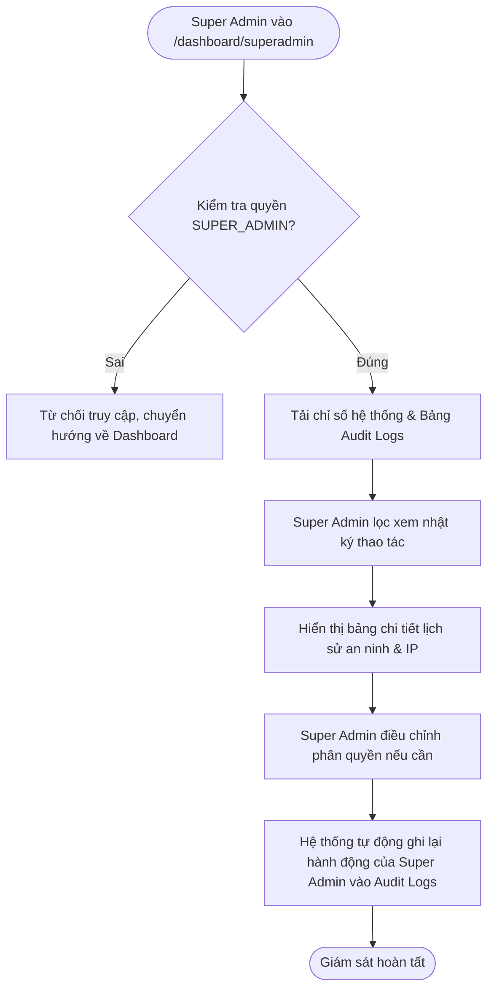

---

## IV. MA TRẬN CHỨC NĂNG (FUNCTIONAL MATRIX)

Bảng ma trận chức năng - tác nhân dưới đây hệ thống hóa chi tiết phạm vi truy cập và quyền hạn của 4 nhóm tác nhân (**Khách vãng lai**, **Học viên**, **Quản trị viên Đào tạo**, **Quản trị viên Tối cao**) đối với từng chức năng (Use Case) trong hệ thống PLT Skill Garden.

| STT | Mã Chức Năng (Use-Case ID) | Tên Chức Năng Nghiệp Vụ | Khách (Guest) | Học Viên (User) | Quản Trị Viên (Admin) | Quản Trị Tối Cao (Super Admin) |
|:---:|:---|:---|:---:|:---:|:---:|:---:|
| 1 | **UC_Register** | Đăng ký tài khoản học viên mới | ✔ | - | - | - |
| 2 | **UC_Login** | Đăng nhập & Xác thực phiên làm việc | ✔ | ✔ | ✔ | ✔ |
| 3 | **UC_Overview** | Bảng điều khiển Tổng quan Vườn số | - | ✔ | ✔ | ✔ |
| 4 | **UC_SkillGarden** | Tương tác Vườn cây 3D & Tưới nước | - | ✔ | ✔ | ✔ |
| 5 | **UC_SkillCatalog** | Danh mục Kỹ năng & Gieo mầm cây | ✔ *(chỉ xem)* | ✔ | ✔ | ✔ |
| 6 | **UC_LearningPath** | Lộ trình Học tập Timeline (Chặng 1..5) | - | ✔ | ✔ | ✔ |
| 7 | **UC_VideoLearning** | Trình phát Video bài học LMS & Ghi chú | - | ✔ | ✔ | ✔ |
| 8 | **UC_QuizRoom** | Phòng Kiểm tra Trắc nghiệm Đánh giá | - | ✔ | ✔ | ✔ |
| 9 | **UC_GoalsBadges** | Nhận thưởng Nhiệm vụ & Bộ sưu tập Huy hiệu | - | ✔ | ✔ | ✔ |
| 10 | **UC_Leaderboard** | Bảng xếp hạng Thi đua Học tập | ✔ *(chỉ xem)* | ✔ | ✔ | ✔ |
| 11 | **UC_NotificationSearch** | Popover Thông báo & Tìm kiếm Header | - | ✔ | ✔ | ✔ |
| 12 | **UC_UserApproval** | Phê duyệt Tài khoản Học viên Mới | - | - | ✔ | ✔ |
| 13 | **UC_CourseManagement** | Quản lý Khóa học, Bài học & Đề thi | - | - | ✔ | ✔ |
| 14 | **UC_PlantManagement** | Quản lý Loài Cây & Cấu hình Gamification | - | - | ✔ | ✔ |
| 15 | **UC_SuperAdmin** | Bảng điều khiển Tối cao & Giám sát Audit Logs | - | - | - | ✔ |

---

## V. PHỤ LỤC & TỪ ĐIỂN THUẬT NGỮ (APPENDIX & GLOSSARY)

### 1. Thuật ngữ viết tắt
- **SRS**: Software Requirements Specification (Tài liệu Đặc tả Yêu cầu Phần mềm).
- **LMS**: Learning Management System (Hệ thống Quản lý Học tập Trực tuyến).
- **Gamification**: Cơ chế ứng dụng trò chơi hóa vào giáo dục để tăng cường sự gắn kết.
- **XP**: Experience Points (Điểm kinh nghiệm tích lũy khi học, làm bài và chăm sóc cây).
- **Streak**: Chuỗi ngày học tập liên tục không ngắt quãng.
- **Level**: Cấp bậc học viên từ 1 đến 10 tương ứng với độ trưởng thành của cây.
- **WebGL / Three.js**: Công nghệ và thư viện kết xuất đồ họa không gian 3D tương tác trên trình duyệt.
- **JWT**: JSON Web Token (Tiêu chuẩn xác thực danh tính người dùng an toàn).
- **WCAG 2.1 AA**: Bộ tiêu chuẩn quốc tế về khả năng tiếp cận nội dung Web với độ tương phản màu sắc cao.
- **Audit Logs**: Nhật ký an ninh lưu trữ các hành động của người dùng để truy vết và kiểm toán.

---
*Tài liệu được ban hành chính thức bởi Ban Công Nghệ & Đào Tạo - PLT Solutions.*
